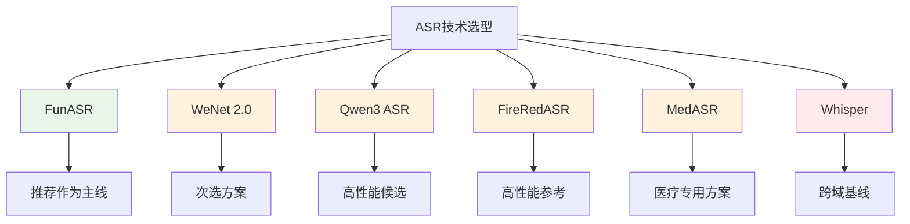
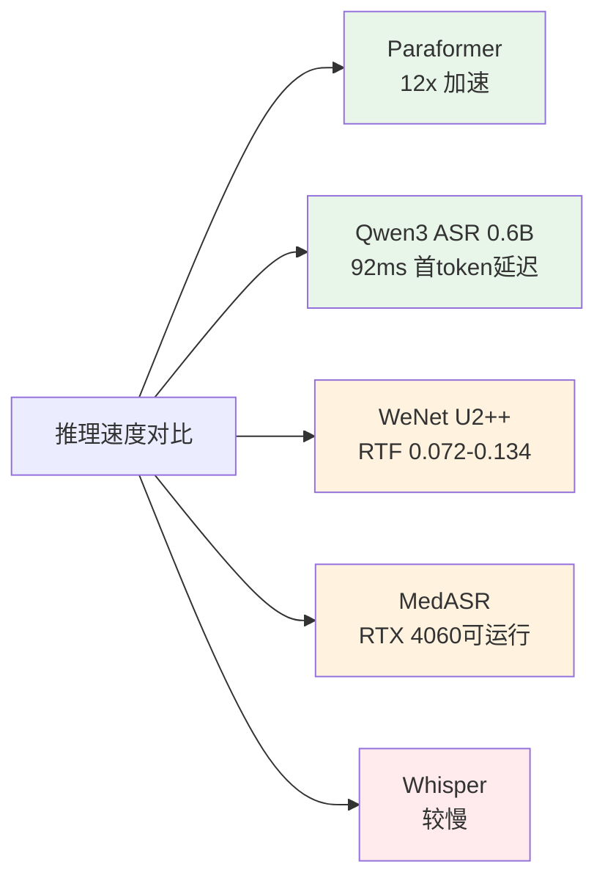
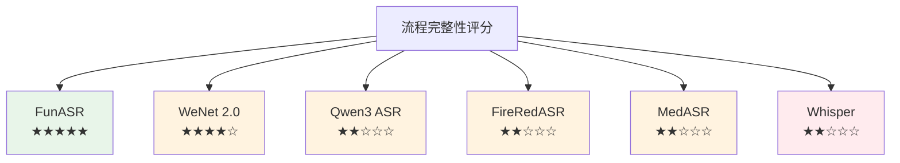
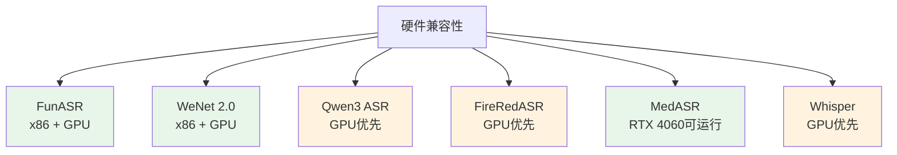
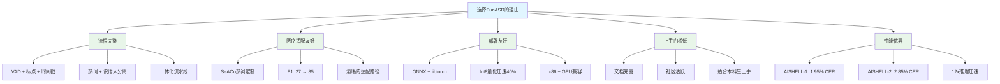
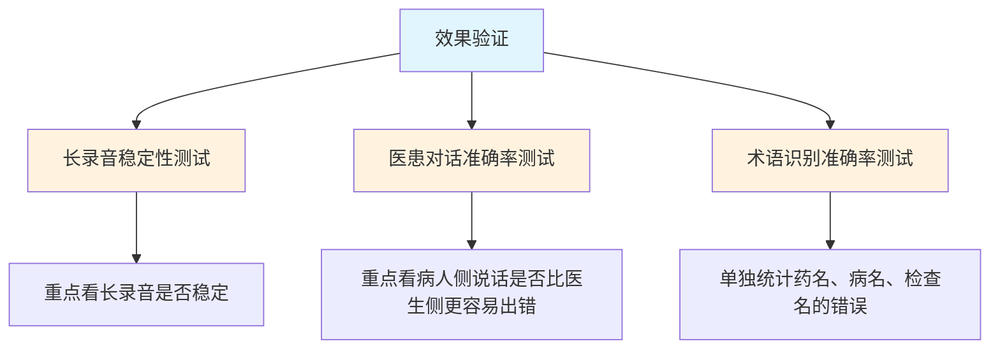
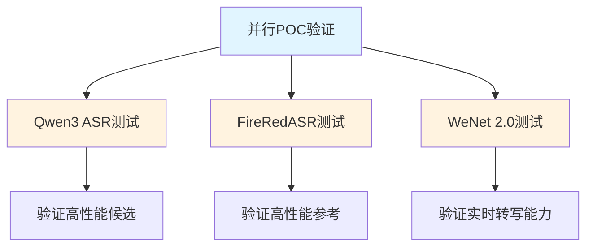

# 技术选型文档

## 1. ASR模块技术选型

### 1.1 选型结论

**选择 FunASR 作为ASR模块的主要技术方案。**

核心组合：FunASR + Paraformer + VAD + 标点恢复

### 1.2 候选方案对比

### 1.3 Benchmark分数对比

#### 1.3.1 中文识别准确率对比

| 模型 | AISHELL-1 CER | AISHELL-2 CER | WenetSpeech Meeting CER | 训练数据规模 |
|------|---------------|---------------|------------------------|-------------|
| Paraformer Large | 1.95% | 2.85% | 6.97% | 50,000 小时 |
| Qwen3 ASR 1.7B | - | 2.71% | 5.88% | 未公开 |
| FireRedASR LLM | - | - | - | 未公开 |
| FireRedASR AED | - | - | - | 未公开 |
| WeNet U2++ | 4.63% | 5.39% | - | 未公开 |
| MedASR | - | - | - | 5,000+ 小时（英文医疗） |
| Whisper Large v2 | - | - | - | 680,000 小时（多语言） |

**数据说明：**

1. **Paraformer Large**
   - AISHELL-1 test: 1.95% CER
   - AISHELL-2 test ios: 2.85% CER
   - WenetSpeech meeting: 6.97% CER
   - 数据来源：FunASR论文

2. **Qwen3 ASR**
   - AISHELL-2 test: 2.71% CER
   - WenetSpeech net: 4.97% CER
   - WenetSpeech meeting: 5.88% CER
   - Fleurs zh: 2.41% CER
   - 数据来源：Qwen3-ASR技术报告

3. **FireRedASR**
   - 四个中文公开集平均CER: 3.05% (LLM版)
   - 四个中文公开集平均CER: 3.18% (AED版)
   - 数据来源：FireRedASR论文

4. **WeNet U2++**
   - AISHELL-1 full: 4.63% CER
   - AISHELL-1 chunk 16: 5.05% CER
   - AISHELL-2 full: 5.39% CER
   - AISHELL-2 chunk 16: 5.78% CER
   - 数据来源：WeNet 2.0论文

5. **MedASR**
   - 放射科听写WER: 4.6%
   - 胸部X光听写WER: 5.2%（比Whisper large-v3少58%错误）
   - 多样化医疗听写基准WER: 5.2%（比Whisper large-v3少82%错误）
   - 内部医疗数据集WER: 4.6%-6.9%
   - **重要说明**：仅支持英文医疗场景，无中文数据
   - 数据来源：Google Health AI

6. **Whisper Large v2**
   - Fleurs zh: 13.8% WER
   - Common Voice 9 Chinese: 26.8% WER
   - 数据来源：Whisper论文

#### 1.3.2 推理速度对比

**速度优势说明：**

1. **Paraformer**
   - 非自回归结构，一次并行生成整段输出
   - 在AISHELL-1和AISHELL-2上超过12倍推理加速
   - 在2万小时工业级中文任务上保持约10倍加速

2. **Qwen3 ASR**
   - 0.6B版本：92毫秒首token延迟
   - 吞吐量高
   - Apache 2.0许可证

3. **WeNet U2++**
   - x86上Int8量化后RTF约0.072到0.134
   - 流式最终延迟约130到142毫秒

4. **MedASR**
   - 105M参数，比Whisper Large小15倍
   - 可在RTX 4060 GPU (8GB VRAM)上运行
   - 轻量化设计，适合资源受限环境

#### 1.3.3 Benchmark数据解读

| 基准 | 更像在测什么 | 对当前项目的意义 |
|------|-------------|----------------|
| AISHELL-1 | 干净普通话朗读 | 看中文基础识别上限 |
| AISHELL-2 | 更大规模工业化朗读语音 | 看模型在中文公开工业基准上的竞争力 |
| WenetSpeech Meeting | 多域真实录音，尤其是Meeting子集 | 看长音频、真实场景和域外稳健性 |
| Fleurs zh | 多语种基准中的中文部分 | 看跨语种泛化能力 |

**重要说明：**

不同论文会混用CER、WER、MER，混用零样本、微调后、流式和离线设置。因此，中文ASR选型不能把不同论文里的单个数字直接横比，更可靠的做法是同时看三件事：

1. 公开中文benchmark是否持续强
2. 证据是否和项目场景匹配
3. 论文是否给出可部署的运行时与流水线信息

### 1.4 ASR各流程评分

#### 1.4.1 流程完整性对比

| 流程环节 | FunASR | WeNet 2.0 | Qwen3 ASR | FireRedASR | MedASR | Whisper |
|---------|--------|-----------|-----------|-----------|--------|---------|
| 语音活动检测(VAD) | ✅ FSMN-VAD | ✅ 支持 | ❌ 无内置 | ❌ 无内置 | ❌ 无内置 | ❌ 无内置 |
| 标点恢复 | ✅ CT-Punc | ✅ 支持 | ❌ 无内置 | ❌ 无内置 | ❌ 无内置 | ❌ 无内置 |
| 时间戳预测 | ✅ 支持 | ✅ 支持 | ✅ 支持 | ✅ 支持 | ✅ 支持 | ✅ 支持 |
| 热词定制 | ✅ SeACo | ✅ 上下文偏置 | ❌ 有限支持 | ❌ 无内置 | ❌ 无内置 | ❌ 有限支持 |
| 说话人分离 | ✅ 支持 | ✅ 支持 | ❌ 无内置 | ❌ 无内置 | ❌ 无内置 | ❌ 无内置 |
| 口语现象处理 | ✅ 支持 | ❌ 无内置 | ❌ 无内置 | ❌ 无内置 | ❌ 无内置 | ❌ 无内置 |

#### 1.4.2 流程完整性评分

**评分依据：**

1. **FunASR（5星）**
   - 提供完整的转写流水线
   - VAD、标点、时间戳、热词、说话人分离、口语现象处理全部内置
   - 论文中明确说明这是一整套可部署流水线
   - 热词能力在AISHELL命名实体子集上把F1从27提高到85

2. **WeNet 2.0（4星）**
   - 支持VAD、标点、时间戳、热词
   - 缺少口语现象处理
   - 工程化强，但流程完整性略逊于FunASR
   - contextual biasing在正样本集上可把CER从14.94拉到6.17

3. **Qwen3 ASR（2星）**
   - 仅支持时间戳预测
   - 缺少VAD、标点恢复、热词定制等关键流程
   - 需要额外集成其他组件

4. **FireRedASR（2星）**
   - 仅支持时间戳预测
   - 缺少VAD、标点恢复、热词定制等关键流程
   - 需要额外集成其他组件

5. **MedASR（2星）**
   - 仅支持时间戳预测
   - 缺少VAD、标点恢复、热词定制等关键流程
   - 需要额外集成其他组件
   - **重要说明**：仅支持英文医疗场景

6. **Whisper（2星）**
   - 仅支持时间戳预测
   - 缺少VAD、标点恢复、热词定制等关键流程
   - 若要做实时系统，还要额外引入两遍解码等适配工作

### 1.5 医疗场景适配能力

#### 1.5.1 医疗术语识别能力

| 方案 | 热词定制 | 术语召回提升 | 医疗适配路径 | 语言支持 |
|------|---------|-------------|-------------|---------|
| FunASR | SeACo Paraformer | F1: 27 → 85 | 热词 → 上下文偏置 | 中文 |
| WeNet 2.0 | 上下文偏置 | CER: 14.94 → 6.17 | 词汇表 + LM + WFST | 中文 |
| Qwen3 ASR | 有限支持 | 未公开详细数据 | 不明确 | 中文 |
| FireRedASR | 无内置 | 未公开详细数据 | 不明确 | 中文 |
| MedASR | 无内置 | WER: 4.6%-6.9% | 医疗专用训练 | 英文 |
| Whisper | 有限支持 | 未公开详细数据 | 不明确 | 多语言 |

**医疗场景证据：**

1. **MMedFD医疗对话基准**
   - 微调后的Whisper small平均WER为27.48，CER为26.95
   - user一侧的WER高达53.11，而agent一侧只有1.84
   - 说明医疗对话的难点是重叠、打断、回声、远场和说话人切换

2. **稀有词处理证据**
   - MED IT医疗访谈数据上，post-decoder biasing对低频词能带来9.3和5.1的相对改善
   - 中文contextual biasing研究中，spike triggered deep biasing对整体CER带来32.0的相对下降，对偏置短语带来68.6的相对下降

3. **MedASR医疗专用证据**
   - 放射科听写WER: 4.6%，比Whisper large-v3少58%错误
   - 胸部X光听写WER: 5.2%，比Whisper large-v3少82%错误
   - 多样化医疗听写基准WER: 5.2%
   - 内部医疗数据集WER: 4.6%-6.9%
   - **重要说明**：仅支持英文医疗场景，无中文数据

#### 1.5.2 医疗适配路径

**分层说明：**

1. **第一层：通用中文模型**
   - 使用Paraformer + VAD + 标点恢复
   - 建立稳定的通用中文转写能力

2. **第二层：热词定制**
   - 接入科室术语表
   - 使用SeACo Paraformer提升术语召回
   - F1从27提升到85

3. **第三层：上下文偏置**
   - 使用WeNet 2.0的上下文偏置
   - 接入n-gram LM或WFST
   - CER从14.94拉到6.17

4. **第四层：领域微调**
   - 仅在热词和上下文偏置不足时考虑
   - 使用轻量领域适配方法

### 1.6 部署友好性

#### 1.6.1 部署后端支持

| 部署后端 | FunASR | WeNet 2.0 | Qwen3 ASR | FireRedASR | MedASR | Whisper |
|---------|--------|-----------|-----------|-----------|--------|---------|
| ONNX | ✅ 支持 | ✅ 支持 | ✅ 支持 | 未公开 | ✅ 支持 | ✅ 支持 |
| libtorch | ✅ 支持 | ✅ 支持 | 未公开 | 未公开 | ✅ 支持 | ✅ 支持 |
| Int8量化 | ✅ 支持 | ✅ 支持 | 未公开 | 未公开 | 未公开 | ✅ 支持 |
| 量化后加速 | 40% | 未公开 | 未公开 | 未公开 | 未公开 | 未公开 |

#### 1.6.2 硬件兼容性

**硬件兼容性说明：**

1. **FunASR**
   - ONNX和libtorch后端支持Int8量化
   - 量化后推理速度可再提升约40%，字符错误率几乎不变
   - x86上RTF在0.072到0.134之间，说明CPU侧有较强可用性

2. **WeNet 2.0**
   - 在x86上报告了Int8推理结果
   - RTF大约在0.072到0.134之间
   - 流式最终延迟约130到142毫秒

3. **Qwen3 ASR**
   - 0.6B版本：92毫秒首token延迟
   - Apache 2.0许可证
   - 部署后端信息较少

4. **FireRedASR**
   - 提供LLM版（8.3B）和AED版（1.1B）
   - 部署后端信息较少

5. **MedASR**
   - 105M参数，比Whisper Large小15倍
   - 可在RTX 4060 GPU (8GB VRAM)上运行
   - 支持ONNX和libtorch后端
   - 轻量化设计，适合资源受限环境

6. **轻量化证据**
   - 中文ASR在笔记本级硬件上不一定要依赖大模型
   - Transformer ASR可从248 MB压缩到24 MB，压缩超过10倍
   - 字符错误率只从6.49上升到6.92

### 1.7 上手门槛

#### 1.7.1 文档与社区

| 方案 | 文档完善度 | 社区活跃度 | 许可证 | 医疗适配文档 |
|------|-----------|-----------|--------|-------------|
| FunASR | ★★★★★ | ★★★★★ | MIT | 有热词定制文档 |
| WeNet 2.0 | ★★★★☆ | ★★★★☆ | Apache 2.0 | 有上下文偏置文档 |
| Qwen3 ASR | ★★★☆☆ | ★★★☆☆ | Apache 2.0 | 无专门文档 |
| FireRedASR | ★★☆☆☆ | ★★☆☆☆ | 未公开 | 无专门文档 |
| MedASR | ★★★★☆ | ★★★☆☆ | Apache 2.0 | 医疗专用模型 |
| Whisper | ★★★★★ | ★★★★★ | MIT | 无专门文档 |

**上手门槛说明：**

1. **FunASR**
   - 文档完善，社区活跃
   - 提供热词定制文档
   - 适合本科生快速上手

2. **WeNet 2.0**
   - 文档较完善，社区较活跃
   - 提供上下文偏置文档
   - 上手门槛略高

3. **Qwen3 ASR**
   - 文档较少，社区较新
   - 无医疗适配专门文档
   - 需要自行探索

4. **FireRedASR**
   - 文档较少，社区较小
   - 无医疗适配专门文档
   - 工程成熟度不足

5. **MedASR**
   - 文档较完善
   - 医疗专用模型，无需额外适配
   - **重要说明**：仅支持英文医疗场景
   - Apache 2.0许可证

6. **Whisper**
   - 文档完善，社区活跃
   - 无医疗适配专门文档
   - 中文不是原生优势

### 1.8 选择FunASR的理由总结

#### 1.8.1 核心优势

#### 1.7.2 详细理由

**1. 流程完整（最核心优势）**

- 提供完整的转写流水线，而非单一模型
- VAD、标点、时间戳、热词、说话人分离、口语现象处理全部内置
- 论文中明确说明这是一整套可部署流水线
- 适合本科生在笔记本上先把系统跑通
- **对比Qwen3 ASR和FireRedASR**：这两个方案虽然benchmark分数优异，但缺少VAD、标点恢复、热词定制等关键流程，需要额外集成其他组件

**2. 医疗适配友好**

- SeACo Paraformer提供热词定制能力
- 热词能力在AISHELL命名实体子集上把F1从27提高到85
- 代码和测试集都开源，且在FunASR生态里
- 提供清晰的医疗适配路径（热词 → 上下文偏置 → 领域微调）
- **医疗场景证据**：MMedFD基准显示医疗对话的难点是重叠、打断、回声、远场和说话人切换，需要完整的流水线支持

**3. 部署友好**

- 支持ONNX和libtorch后端
- 支持Int8量化，量化后推理速度可再提升约40%
- x86和GPU都有良好兼容性
- 适合消费级笔记本部署
- **对比Qwen3 ASR和FireRedASR**：部署后端信息较少，工程化程度不如FunASR成熟

**4. 上手门槛低**

- 文档完善，社区活跃
- 适合本科生快速上手
- 提供完整的示例代码和教程
- **对比WeNet 2.0**：WeNet虽然工程化强，但上手门槛略高

**5. 性能优异**

- Paraformer Large在AISHELL-1上达到1.95% CER
- Paraformer Large在AISHELL-2上达到2.85% CER
- 在WenetSpeech meeting上达到6.97% CER
- 非自回归结构带来12倍推理加速
- **对比Qwen3 ASR和FireRedASR**：虽然benchmark分数略逊，但差距不大，且流程完整性优势明显

#### 1.7.3 与其他方案的对比

| 对比维度 | FunASR | WeNet 2.0 | Qwen3 ASR | FireRedASR | Whisper |
|---------|--------|-----------|-----------|-----------|---------|
| 中文优化 | ✅ 专门优化 | ✅ 专门优化 | ✅ 专门优化 | ✅ 专门优化 | ❌ 多语言通用 |
| 推理速度 | ✅ 12x加速 | ✅ RTF 0.07-0.13 | ✅ 92ms首token | ⚠️ 信息较少 | ❌ 较慢 |
| 流程完整性 | ✅ 5星 | ✅ 4星 | ❌ 2星 | ❌ 2星 | ❌ 2星 |
| 医疗适配 | ✅ 热词定制 | ✅ 上下文偏置 | ❌ 有限支持 | ❌ 无内置 | ❌ 有限支持 |
| 部署友好 | ✅ ONNX+libtorch | ✅ ONNX+libtorch | ⚠️ 信息较少 | ⚠️ 信息较少 | ✅ ONNX |
| 上手难度 | ✅ 低 | ⚠️ 中等 | ⚠️ 中等 | ⚠️ 信息较少 | ✅ 低 |
| 文档质量 | ✅ 完善 | ✅ 完善 | ✅ 完善 | ⚠️ 信息较少 | ✅ 完善 |
| 工程成熟度 | ✅ 高 | ✅ 高 | ⚠️ 新 | ⚠️ 新 | ✅ 高 |

#### 1.7.4 为什么不选择其他方案

**为什么不选择Qwen3 ASR？**

1. **流程不完整**：缺少VAD、标点恢复、热词定制等关键流程
2. **需要额外集成**：需要集成其他组件才能构建完整系统
3. **工程成熟度不足**：论文很新，部分关键结论依赖内部评测
4. **适合场景**：更适合作为高性能候选，做并行POC验证

**为什么不选择FireRedASR？**

1. **流程不完整**：缺少VAD、标点恢复、热词定制等关键流程
2. **工程成熟度不足**：工程生态还在形成
3. **部署信息较少**：部署后端信息较少
4. **适合场景**：更适合作为高性能参考线

**为什么不选择WeNet 2.0作为主线？**

1. **上手门槛略高**：工程化强，但上手门槛略高
2. **流程完整性略逊**：缺少口语现象处理
3. **适合场景**：更适合实时转写与长期工程主线

**为什么不选择Whisper作为主线？**

1. **中文不是原生优势**：byte level BPE tokenizer对中文不理想
2. **流程不完整**：缺少VAD、标点恢复、热词定制等关键流程
3. **中文benchmark表现不佳**：Fleurs zh 13.8%，Common Voice 9 Chinese 26.8%
4. **适合场景**：更适合作为跨域鲁棒基线和对照实验

### 1.8 实施建议

#### 1.8.1 第一阶段：基础系统搭建

**具体步骤：**

1. 安装FunASR工具包
2. 加载Paraformer Large中文模型
3. 启用FSMN-VAD和CT-Transformer标点恢复
4. 优先选择ONNX或libtorch路线
5. 如果速度不够，再尝试Int8量化

#### 1.8.2 第二阶段：效果验证

**验证重点：**

1. **长录音稳定性**
   - 测试30秒以上的长音频转写
   - 验证VAD切分是否合理
   - 检查内存和CPU使用情况

2. **医患对话准确率**
   - 重点看病人侧说话是否比医生侧更容易出错
   - MMedFD基准显示user一侧的WER高达53.11，而agent一侧只有1.84
   - 这在医疗对话里很常见（病人离麦更远）

3. **术语识别准确率**
   - 单独统计药名、病名、检查名的错误
   - 而不是只看总体字错率
   - 使用AISHELL命名实体子集进行验证

#### 1.8.3 第三阶段：医疗适配

**适配步骤：**

1. 为目标科室整理热词表
2. 切到SeACo Paraformer或FunASR的上下文热词能力
3. 先追求术语召回，再考虑更重的领域微调
4. 验证术语召回是否达到预期（目标：F1从27提升到85）

#### 1.8.4 第四阶段：并行POC验证（可选）

**POC目的：**

1. **Qwen3 ASR**
   - 验证其在真实医疗场景的表现
   - 评估是否需要集成额外组件
   - 对比与FunASR的性能差距

2. **FireRedASR**
   - 验证其在真实医疗场景的表现
   - 评估工程化可行性

3. **WeNet 2.0**
   - 验证实时转写能力
   - 评估是否需要流式处理

### 1.9 风险与应对

#### 1.9.1 潜在风险

| 风险类型 | 风险描述 | 应对措施 |
|---------|---------|---------|
| 硬件兼容性 | Ryzen 780M无实测数据 | 先用CPU模式，再考虑GPU加速 |
| 术语召回不足 | 通用模型对医学术语识别不够 | 使用SeACo热词定制，F1从27提升到85 |
| 长音频处理 | 内存占用可能较高 | 使用VAD分段处理 |
| 部署复杂度 | 需要配置多个模型 | 使用FunASR一体化方案 |
| 性能不如预期 | Benchmark分数略逊于Qwen3 ASR | 做并行POC验证，根据实际场景选择 |

#### 1.9.2 备选方案

如果FunASR在实际使用中遇到问题，可以按以下顺序考虑备选方案：

1. **WeNet 2.0**
   - 工程化强，支持流式和非流式
   - 支持LM和WFST，上下文偏置清晰
   - 适合术语定制需求变强后

2. **Qwen3 ASR**
   - Benchmark分数优异
   - 需要额外集成VAD、标点恢复等组件
   - 适合对性能要求极高的场景

3. **FireRedASR**
   - Benchmark分数优异
   - 需要额外集成组件
   - 适合作为高性能参考

4. **MedASR**
   - 医疗专用模型，WER 4.6%-6.9%
   - **重要限制**：仅支持英文医疗场景
   - 如果项目需要支持英文医疗场景，可作为备选

### 1.10 总结

选择FunASR作为ASR模块的主要技术方案，是基于以下核心考量：

1. **流程完整**：提供完整的转写流水线，这是最核心的优势
2. **医疗适配友好**：SeACo热词定制能力强大，F1从27提升到85
3. **部署友好**：支持多种部署后端和量化方案
4. **上手门槛低**：适合本科生快速上手
5. **性能优异**：Paraformer Large在中文基准测试上表现优异

**核心优势不是某一项指标绝对最好，而是它把"流程完整，医疗适配友好，部署友好，上手门槛低，性能优异"放在同一条连续路径上。**

对当前任务，这比从一开始就押注benchmark分数更高但流程不完整的方案（如Qwen3 ASR、FireRedASR），或上手门槛更高的方案（如WeNet 2.0），或中文不是原生优势的方案（如Whisper），或仅支持英文医疗场景的方案（如MedASR），更稳也更快。

**建议的实施路径：**

1. **第一阶段**：使用FunASR搭建基础系统
2. **第二阶段**：验证效果，重点关注医患对话和术语识别
3. **第三阶段**：医疗适配，使用热词定制提升术语召回
4. **第四阶段**：并行POC验证Qwen3 ASR和FireRedASR，根据实际场景决定是否切换
