# 项目架构文档

## 系统架构图

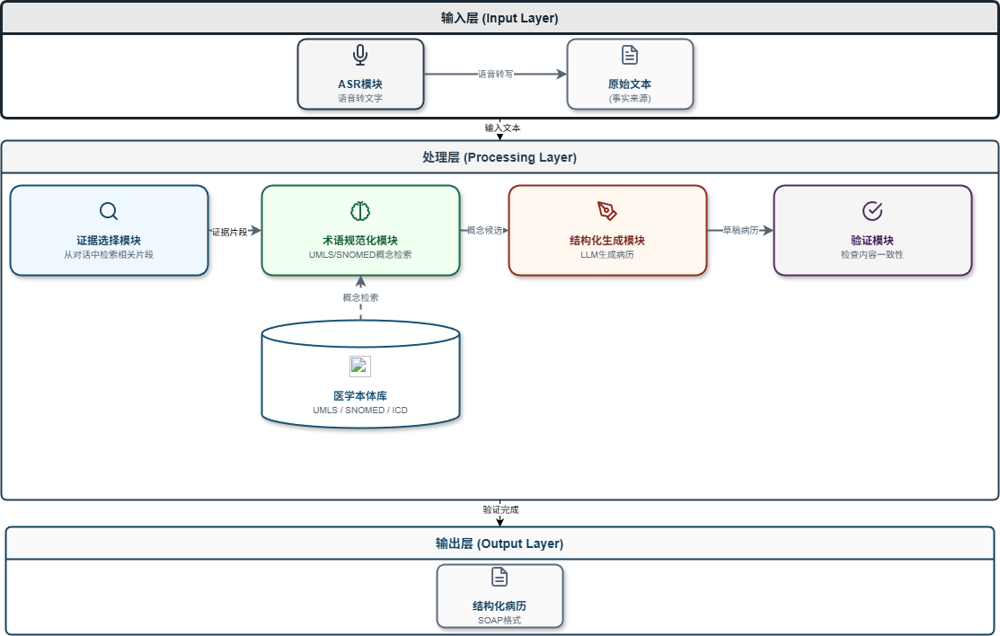

### 系统架构说明

系统采用分层架构设计，分为三层：

**输入层 (Input Layer)**：

- **ASR模块**：负责将语音信号转换为文本，支持实时转写和批量处理
- **原始文本**：作为事实来源，保存完整的对话内容

**处理层 (Processing Layer)**：

- **证据选择模块**：从对话文本中检索与病历生成相关的片段
- **术语规范化模块**：将口语化表达映射到标准医学术语，支持UMLS/SNOMED概念检索
- **结构化生成模块**：基于LLM生成符合SOAP格式的结构化病历
- **验证模块**：检查生成病历的内容一致性，确保与原始对话相符
- **医学本体库**：存储标准医学术语和概念，为术语规范化提供支持

**输出层 (Output Layer)**：

- **结构化病历**：最终输出的SOAP格式病历文档

## 数据流程图

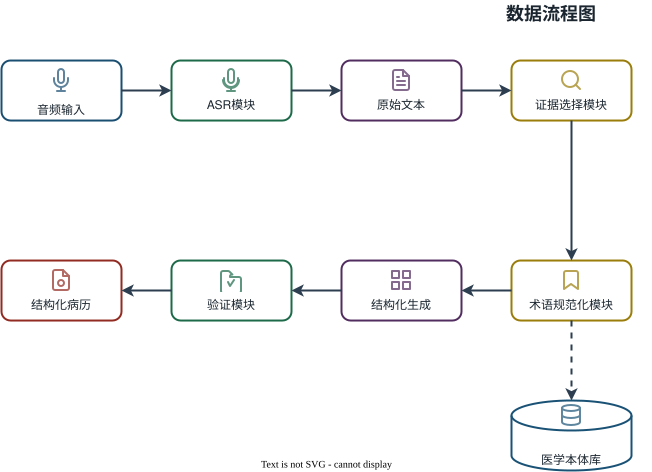

### 数据流程说明

数据流程展示了从音频输入到结构化病历输出的完整处理过程：

**主要处理流程**：

1. **音频输入**：接收医疗问诊的音频数据
2. **ASR转写**：将音频转换为原始文本，保留时间戳和说话人信息
3. **原始文本**：存储完整的对话文本作为后续处理的事实依据
4. **证据选择**：从对话中提取与病历相关的关键片段
5. **术语规范化**：将口语化术语映射为标准医学术语，查询医学本体库获取概念编码
6. **结构化生成**：基于规范化后的证据生成SOAP格式病历
7. **验证检查**：验证病历内容的完整性和一致性
8. **结构化病历**：输出最终的结构化病历文档

**数据交互**：

- 术语规范化模块与医学本体库交互，获取标准术语映射
- 各模块间通过标准化的数据格式传递信息

## 当前目录结构

```
MedicalAssisstant/
├── backend/                    # 后端服务
│   ├── api/                   # API 路由
│   │   ├── __init__.py
│   │   ├── asr.py             # ASR 相关 API
│   │   ├── task.py            # 任务管理 API
│   │   ├── upload.py          # 上传 API
│   │   ├── llm.py             # LLM 配置管理 API
│   │   ├── emr.py             # 病历生成 API
│   │   └── evaluation.py      # 病历质量评估 API
│   ├── models/                # 数据模型
│   │   ├── __init__.py
│   │   ├── task.py            # 任务模型
│   │   ├── transcript.py      # 转写记录模型（含ASRCorrection）
│   │   ├── visit.py           # 就诊记录模型
│   │   ├── llm_config.py      # LLM配置模型
│   │   ├── evidence.py        # 证据片段模型
│   │   ├── term.py            # 规范化术语模型（含UMLS编码）
│   │   ├── extracted_item.py  # 抽取要素模型
│   │   ├── emr_record.py      # 病历记录模型
│   │   └── evaluation_record.py # 评估记录模型
│   ├── services/              # 业务服务
│   │   ├── __init__.py
│   │   ├── asr_service.py     # ASR 服务（封装FunASR）
│   │   ├── normalizer.py      # 术语规范化服务
│   │   ├── postprocessor.py   # 后处理服务（医疗术语纠错）
│   │   ├── llm/               # LLM服务模块
│   │   │   ├── __init__.py
│   │   │   ├── base.py        # LLM基类
│   │   │   ├── openai_compatible_adapter.py # OpenAI兼容接口
│   │   │   ├── prompts.py     # Prompt模板管理（中英文）
│   │   │   └── llm_service.py # LLM服务封装
│   │   ├── umls/              # UMLS医学术语库模块
│   │   │   ├── __init__.py    # 数据类定义
│   │   │   ├── umls_client.py # UMLS API客户端（同步）
│   │   │   ├── async_umls_client.py # UMLS API客户端（异步，支持并发）
│   │   │   └── term_cache.py  # 术语缓存管理
│   │   ├── llm_pipeline_service.py    # LLM多阶段处理（中文提示词）
│   │   ├── llm_pipeline_service_en.py # LLM多阶段处理（英文提示词，跳过翻译优化）
│   │   ├── evidence_service.py # 证据选择服务
│   │   ├── terminology_service.py # 术语规范化服务（集成UMLS，支持并行处理）
│   │   ├── translation_service.py # 中英文翻译服务（专门翻译小模型）
│   │   ├── extraction_service.py # 病历要素抽取服务
│   │   ├── emr_generation_service.py # 病历生成服务
│   │   ├── medical_record_pipeline.py # 病历生成流水线（支持并行处理）
│   │   ├── evaluation/         # 病历质量评估模块
│   │   │   ├── __init__.py     # 模块入口
│   │   │   ├── base.py         # 评估器基类
│   │   │   ├── consistency.py  # 一致性评估服务
│   │   │   ├── completeness.py # 完整性评估服务
│   │   │   ├── quality.py      # 文档质量评估服务
│   │   │   ├── safety.py       # 安全风险评估服务
│   │   │   └── evaluation_pipeline.py # 评估流水线
│   │   └── validation_service.py # 病历验证服务（规则验证）
│   ├── utils/                 # 工具函数
│   │   ├── __init__.py
│   │   └── audio_utils.py     # 音频处理工具
│   ├── __init__.py
│   ├── config.py              # 配置管理（pydantic-settings）
│   ├── database.py            # 数据库连接（SQLAlchemy）
│   └── main.py                # FastAPI应用入口
├── config/                     # 配置文件
│   ├── asr_correction_rules.json # ASR 纠正规则（医疗术语映射）
│   └── hotwords_medical.txt    # 医疗热词表（80+术语）
├── data/                       # 数据存储（运行时创建）
│   ├── audio/                  # 上传的音频文件
│   ├── cache/                  # 缓存数据
│   │   └── umls/               # UMLS术语缓存
│   └── database/               # SQLite数据库文件
├── docs/                       # 文档
│   ├── architecture.md         # 架构文档 (本文件)
│   ├── completion_status.md    # 完成状态记录
│   ├── 技术选型文档.md          # ASR技术选型分析
│   ├── 说话人分离使用说明.md    # 说话人分离功能说明
│   └── specs/                  # 规格文档
│       └── 2026-04-12-m1-milestone-design.md
├── .trae/                      # Trae工具目录
│   └── documents/              # Trae文档
│       └── 病历生成流程性能优化计划.md # 性能优化计划文档
├── frontend/                   # 前端界面
│   ├── css/
│   │   └── style.css          # 样式文件
│   ├── js/
│   │   ├── result.js          # 结果页面脚本
│   │   ├── upload.js          # 上传页面脚本
│   │   ├── emr.js             # 病历生成页面脚本
│   │   ├── evaluation.js      # 病历质量评估页面脚本
│   │   └── config.js          # LLM配置页面脚本
│   ├── index.html             # 上传页面
│   ├── result.html            # 结果展示页面
│   ├── emr.html               # 病历生成页面
│   ├── evaluation.html        # 病历质量评估页面
│   └── config.html            # LLM配置页面
├── output/                     # 输出目录
│   └── raw_asr_result.json    # ASR原始输出
├── scripts/                    # 脚本
│   ├── demo_diarization.py    # 说话人分离演示
│   ├── test_diarization.py    # 说话人分离测试
│   ├── test_diarization_debug.py # 调试脚本
│   ├── test_diarization_with_tts.py # TTS测试脚本
│   ├── test_qwen3_asr.py      # Qwen3-ASR测试脚本
│   ├── test_translation_service.py # 翻译服务测试脚本
│   ├── test_parallel_terminology.py # 术语规范化并行测试脚本
│   ├── test_performance_optimization.py # 性能优化测试脚本
│   └── set_cache_path.bat     # 设置缓存路径脚本
├── src/                        # 核心源代码
│   ├── asr/                   # ASR 模块
│   │   ├── __init__.py        # 模块入口
│   │   ├── base.py            # 抽象基类（ASRResult数据类）
│   │   ├── factory.py         # 工厂模式
│   │   ├── funasr_engine.py   # FunASR 实现（支持说话人分离）
│   │   ├── medasr_engine.py   # MedASR 实现（仅英文）
│   │   ├── qwen3_asr_engine.py # Qwen3-ASR 实现（高性能中文ASR）
│   │   └── test_confid.py     # 置信度测试
│   └── __init__.py
├── .gitignore
├── README.md                   # 项目说明
├── requirements.txt           # 项目依赖
└── requirements-asr.txt       # ASR专用依赖
```

## 系统架构设计

### 设计原则

本系统采用分层架构：

- **事实来源单一**：对话文本作为唯一事实来源
- **分层处理**：证据选择 → 术语规范化 → 结构化生成 → 验证
- **受控术语增强**：术语规范化作为受控的第二步，而非开放式检索

## 详细系统设计

### 1. ASR模块详细设计

#### 1.1 ASR模块整体流程

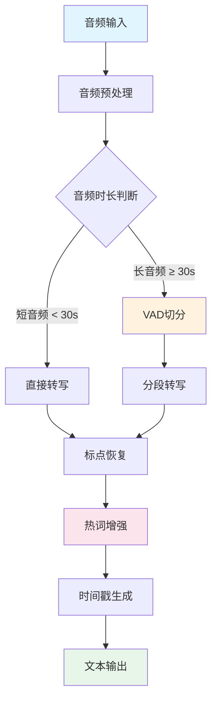

#### 1.2 音频预处理流程


**实现步骤：**

1. **格式检查**
   - 支持格式：WAV、MP3、FLAC、OGG
   - 不支持格式：返回错误提示
2. **采样率标准化**
   - 目标采样率：16000 Hz
   - 重采样算法：librosa.resample()
   - 原因：ASR模型训练时使用16kHz
3. **声道处理**
   - 多声道音频：取平均值转为单声道
   - 单声道音频：直接使用
   - 原因：医疗问诊场景通常为单声道录音
4. **音量归一化**
   - 目标：峰值音量归一化到-3dB
   - 方法：计算音频RMS值，应用增益
   - 原因：提高识别稳定性

#### 1.3 长音频切分策略

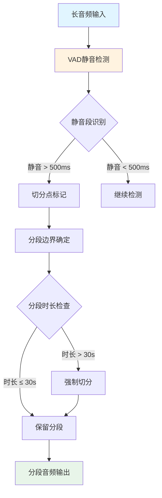

**切分规则：**

| 规则类型   | 参数值    | 说明              |
| ------ | ------ | --------------- |
| 静音阈值   | -40 dB | 低于此值视为静音        |
| 最小静音时长 | 500 ms | 静音持续超过此时长才切分    |
| 最大分段时长 | 30 秒   | 单段不超过30秒，避免内存溢出 |
| 最小分段时长 | 1 秒    | 单段至少1秒，避免碎片化    |
| 边界缓冲   | 100 ms | 切分点前后各保留100ms静音 |

**VAD模型选择：**

- **FunASR-VAD**：基于FSMN的语音活动检测模型（听到当前声音时，它会快速翻看记忆中记录的之前几秒和之后几秒的关键信息，结合完整的上下文再做判断）
- **优势**：准确率高，支持实时检测
- **输出**：每个语音段的起止时间戳

#### 1.4 静音处理策略

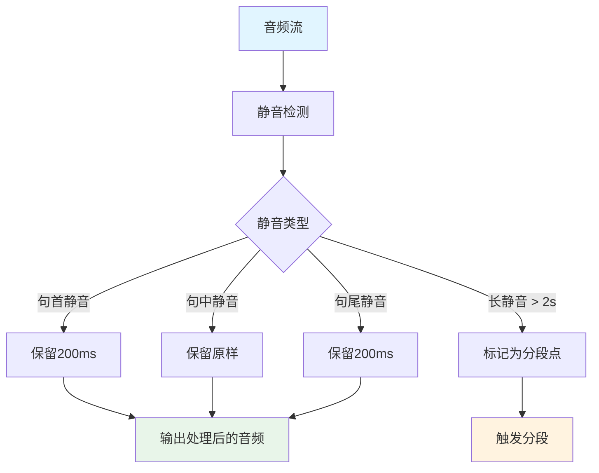

**处理策略：**

1. **句首静音**
   - 保留前200ms静音
   - 原因：避免语音起始部分被截断
2. **句中静音**
   - 保留原样
   - 原因：自然停顿，有助于理解语义
3. **句尾静音**
   - 保留后200ms静音
   - 原因：避免语音结尾部分被截断
4. **超长静音**
   - 静音超过2秒，标记为分段点
   - 原因：可能表示话题切换

#### 1.5 文本标点恢复

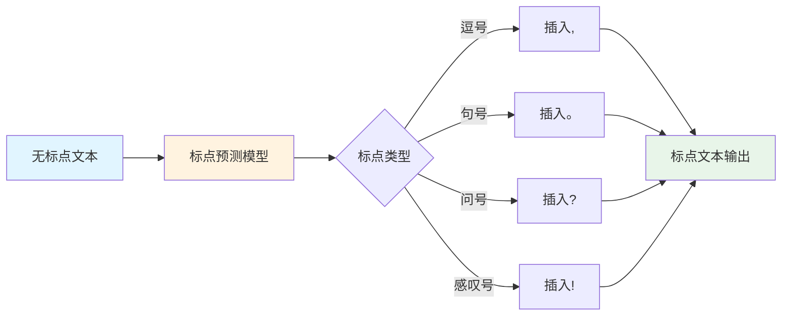

**实现方案：**

| 方案             | 模型        | 准确率  | 速度 | 适用场景       |
| -------------- | --------- | ---- | -- | ---------- |
| FunASR-CT-Punc | ct-punc   | 95%+ | 快  | 中文医疗场景（推荐） |
| 基于规则           | 正则表达式     | 70%  | 极快 | 简单场景       |
| 基于BERT         | BERT-punc | 98%  | 慢  | 高精度要求      |

**标点恢复流程：**

1. **输入**：ASR输出的无标点文本
2. **分词**：按字符切分（中文）
3. **预测**：模型预测每个位置后的标点类型
4. **插入**：根据预测结果插入标点符号
5. **后处理**：修正明显的标点错误（如连续标点）

#### 1.6 时间戳生成

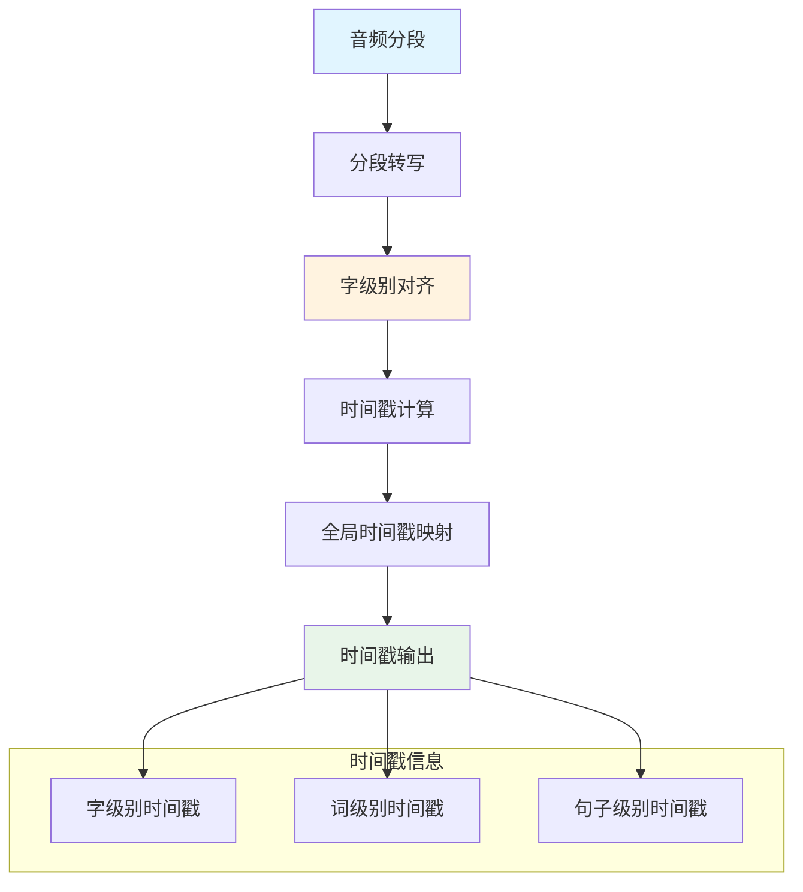

**时间戳层级：**

| 层级   | 粒度   | 用途         |
| ---- | ---- | ---------- |
| 字级别  | 每个汉字 | 精确定位、字幕生成  |
| 词级别  | 每个词语 | 关键词检索、术语提取 |
| 句子级别 | 每个句子 | 章节划分、摘要生成  |

**时间戳计算方法：**

1. **分段偏移量**：记录每个分段在整个音频中的起始时间
2. **字级别对齐**：使用CTC解码路径计算每个字的起止时间
3. **全局映射**：分段偏移量 + 字级别时间 = 全局时间戳

**输出格式：**

```json
{
  "text": "患者主诉头痛三天",
  "segments": [
    {
      "start": 0.0,
      "end": 2.5,
      "text": "患者主诉头痛三天",
      "words": [
        {"word": "患者", "start": 0.0, "end": 0.5},
        {"word": "主诉", "start": 0.6, "end": 1.1},
        {"word": "头痛", "start": 1.2, "end": 1.7},
        {"word": "三天", "start": 1.8, "end": 2.5}
      ]
    }
  ]
}
```

#### 1.7 热词增强机制

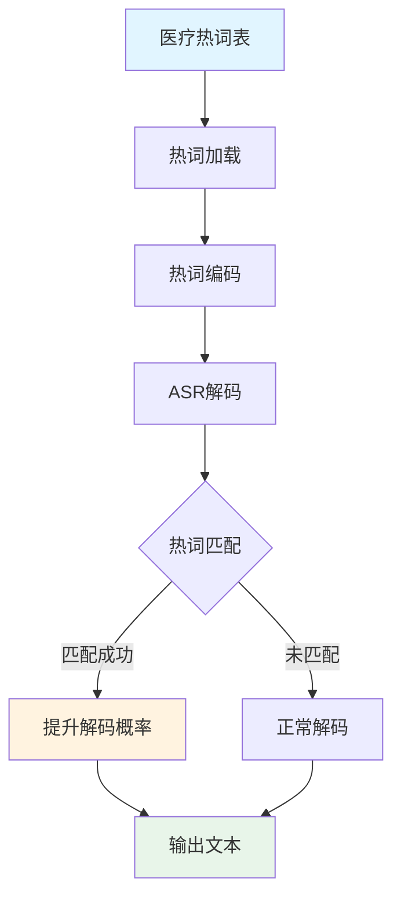

**热词表结构：**

| 字段 | 说明          | 示例        |
| -- | ----------- | --------- |
| 术语 | 医学专业术语      | 阿莫西林、头孢克肟 |
| 权重 | 提升权重（1-100） | 50        |
| 类别 | 术语类别        | 药品、症状、诊断  |

**热词增强原理：**

1. **解码阶段介入**：在ASR解码时，遇到热词表中的词，提升其解码概率
2. **权重计算**：`新概率 = 原概率 × (1 + 权重/100)`
3. **动态调整**：根据上下文动态调整热词权重

**热词表管理：**

- **初始热词表**：包含80+常见医疗术语
- **动态扩展**：根据科室需求添加专业术语
- **权重优化**：根据识别准确率调整权重

#### 1.8 后续服务对接

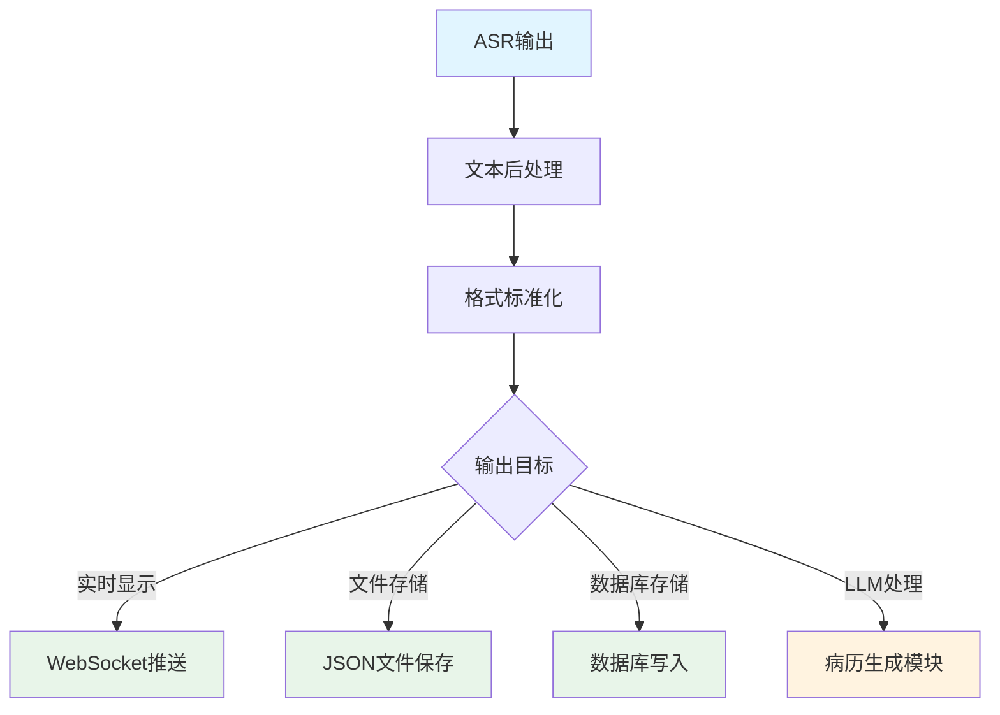

**对接方案：**

| 目标系统  | 接口类型      | 数据格式     | 实时性 |
| ----- | --------- | -------- | --- |
| 前端显示  | WebSocket | JSON     | 实时  |
| 文件存储  | 文件系统      | JSON/TXT | 批量  |
| 数据库   | SQL/NoSQL | 结构化数据    | 批量  |
| LLM模块 | HTTP API  | JSON     | 实时  |

**数据标准化：**

1. **文本清洗**：去除多余空格、标点规范化
2. **说话人分离**：区分医生和患者（需说话人识别模块）
3. **时间戳同步**：确保时间戳与文本对应
4. **格式转换**：转换为下游模块所需格式

#### 1.9 Qwen3-ASR引擎

Qwen3-ASR是阿里巴巴开源的高性能语音识别模型，支持52种语言（包括22种中文方言）。

**模型规格：**

| 模型 | 参数量 | 显存需求 | RTF | 适用场景 |
|------|--------|----------|-----|----------|
| Qwen3-ASR-1.7B | ~2B | 4GB+ | ~0.064 | 高精度转写 |
| Qwen3-ASR-0.6B | ~0.9B | 2GB+ | ~0.064 | 快速转写 |

**架构特点：**

```
Audio (16kHz) → 128-mel Spectrogram → Conv2d×3 (8× downsample)
             → Transformer Encoder → Linear Projector → Qwen3 Decoder → Text
```

**与FunASR对比：**

| 特性 | Qwen3-ASR | FunASR |
|------|-----------|--------|
| 中文准确率 | SOTA (AISHELL-2: 2.71% CER) | 高 (AISHELL-2: 2.85% CER) |
| 说话人分离 | 不支持 | 支持 (cam++模型) |
| 热词增强 | 不支持 | 支持 |
| 长音频处理 | 自动分块 | VAD切分 |
| 流式推理 | 支持 | 支持 |

**使用建议：**

- **需要说话人分离**：使用FunASR
- **仅需高精度转写**：使用Qwen3-ASR
- **医疗术语识别**：FunASR + 热词增强

### 2. 语音采集模块设计

#### 2.1 音频采集流程

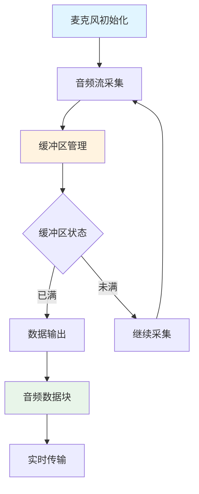

**采集参数：**

| 参数    | 值            | 说明      |
| ----- | ------------ | ------- |
| 采样率   | 16000 Hz     | ASR模型要求 |
| 位深度   | 16 bit       | 标准音频质量  |
| 声道数   | 1            | 单声道     |
| 缓冲区大小 | 1024 samples | 约64ms延迟 |

#### 2.2 多麦克风支持

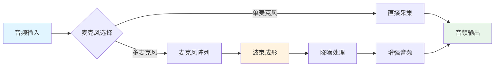

**多麦克风处理：**

1. **波束成形**：聚焦目标声源方向
2. **噪声抑制**：利用多麦克风信息降低环境噪声
3. **回声消除**：去除扬声器回声

### 3. 结构化病历生成模块设计

#### 3.1 病历生成流程

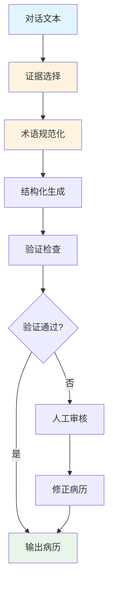

#### 3.2 证据选择模块


**实现方法：**

| 方法   | 技术                 | 优势      | 劣势      |
| ---- | ------------------ | ------- | ------- |
| 向量检索 | Embedding + Cosine | 语义理解强   | 需要预训练模型 |
| BM25 | TF-IDF变体           | 速度快、可解释 | 语义理解弱   |
| 混合检索 | 向量 + BM25          | 综合优势    | 实现复杂    |

#### 3.3 术语规范化模块

##### 3.3.1 串行处理流程（原有）

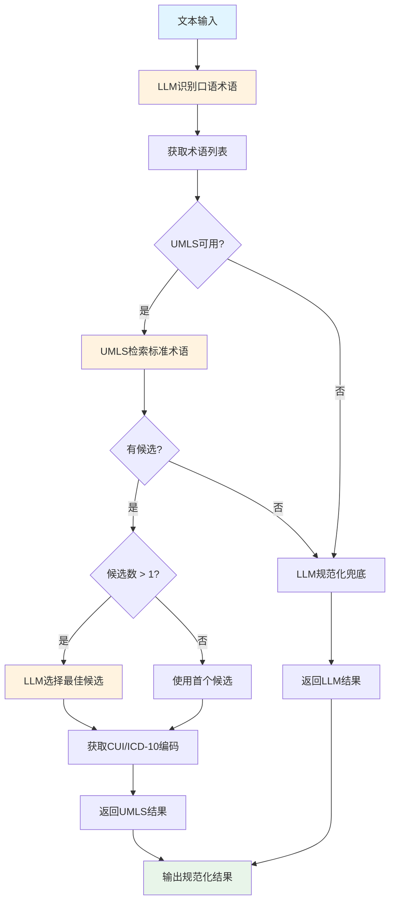

##### 3.3.2 并行处理流程（优化后）

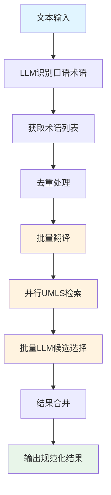

**并行处理流水线架构**：

```
identify_colloquial_terms (批量识别)
    ↓
┌─────────────────────────────────────────────────────┐
│              并行处理流水线                           │
│                                                     │
│  ┌──────────────┐  ┌──────────────┐  ┌──────────────┐│
│  │ 批量翻译     │→ │ 并行UMLS检索 │→ │ 批量LLM选择  ││
│  │ (翻译模型)   │  │ (asyncio)    │  │ (单次LLM调用)││
│  └──────────────┘  └──────────────┘  └──────────────┘│
└─────────────────────────────────────────────────────┘
    ↓
结果合并与返回
```

**并行优化核心组件**：

| 组件 | 文件 | 功能 |
|------|------|------|
| AsyncUMLSClient | `backend/services/umls/async_umls_client.py` | 异步UMLS客户端，支持并发HTTP请求 |
| TranslationService | `backend/services/translation_service.py` | 翻译服务，支持批量翻译 |
| TerminologyService | `backend/services/terminology_service.py` | 术语规范化服务，集成并行处理 |

**性能对比**：

| 测试项 | 串行耗时 | 并行耗时 | 提升 |
|--------|---------|---------|------|
| 批量翻译 (5个术语) | 0.88秒 | 0.43秒 | 2.06x |
| 异步UMLS检索 (5个术语) | - | 4.17秒 | 并发执行 |
| 整体对比 (12个术语) | 436秒 | 229秒 | 1.90x |

**降级策略**：

```
并行模式启用 + AsyncUMLSClient可用 → 并行处理
并行模式禁用 或 AsyncUMLSClient不可用 → 串行处理（原有逻辑）
并行处理失败 → 自动回退到串行处理
```

**并行配置项**：

| 配置项 | 默认值 | 说明 |
|--------|--------|------|
| `UMLS_MAX_CONCURRENT` | 5 | UMLS API最大并发请求数 |
| `TERMINOLOGY_PARALLEL_ENABLED` | True | 是否启用并行模式 |

##### 3.3.3 术语规范化流程说明

| 步骤 | 处理方式 | 置信度范围 | 说明 |
| --- | --- | --- | --- |
| 1. LLM识别 | 大模型识别口语术语 | - | 从文本中提取所有医学术语 |
| 2. UMLS查询 | 在线API查询 | 0.60-0.95 | 主要规范化手段 |
| 3. LLM规范化 | 大模型推理 | 0.30-0.60 | UMLS无结果时兜底 |
| 4. 保留原词 | 无匹配 | 0.30 | 所有方法都失败时保留原词 |

**UMLS集成特性：**

| 特性 | 说明 |
| --- | --- |
| LLM识别术语 | 使用LLM从文本中识别口语化医学术语，无需依赖静态词表 |
| 混合查询 | 优先中文查询，无结果时翻译后英文查询 |
| 候选选择 | 多候选时由LLM选择最佳匹配 |
| 编码获取 | 自动获取ICD-10/SNOMED-CT编码 |
| 缓存机制 | 本地缓存查询结果，减少API调用 |
| 降级策略 | UMLS不可用时自动降级到LLM方案 |

**本体库选择：**

| 本体库 | 覆盖范围 | 语言 | 访问方式 | 当前状态 |
| --- | --- | --- | --- | --- |
| UMLS | 全面 | 多语言 | 需申请许可 | ✅ 已集成 |
| SNOMED CT | 临床术语 | 多语言 | 需申请许可 | 🔜 预留接口 |
| ICD-10 | 诊断编码 | 多语言 | 公开可用 | ✅ 通过UMLS获取 |
| MeSH | 医学主题词 | 英文 | 公开可用 | 🔜 预留接口 |

**规范化输出格式：**

```json
{
  "original_term": "头疼",
  "normalized_term": "头痛",
  "term_type": "symptom",
  "code": "R51",
  "code_system": "ICD-10-CM",
  "source": "UMLS",
  "confidence": 0.95,
  "cui": "C0018681",
  "candidates": [
    {"term": "头痛", "cui": "C0018681", "score": 0.95},
    {"term": "偏头痛", "cui": "C0149931", "score": 0.72}
  ]
}
```

#### 3.4 结构化生成模块


**SOAP格式定义：**

| 章节             | 内容   | 示例               |
| -------------- | ---- | ---------------- |
| S (Subjective) | 主观症状 | 患者主诉头痛三天         |
| O (Objective)  | 客观体征 | 体温37.5℃，血压120/80 |
| A (Assessment) | 评估诊断 | 上呼吸道感染           |
| P (Plan)       | 治疗计划 | 口服阿莫西林，多饮水       |

#### 3.5 验证模块

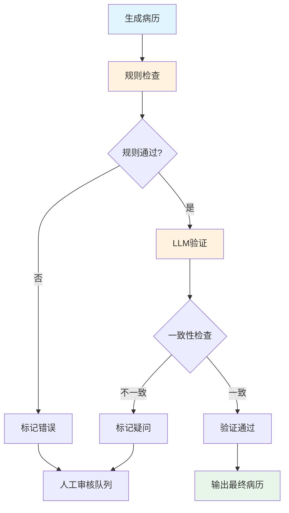

**验证规则：**

| 规则类型  | 检查内容      | 示例          |
| ----- | --------- | ----------- |
| 完整性检查 | 必填字段是否存在  | SOAP各章节是否完整 |
| 一致性检查 | 病历与对话是否一致 | 诊断是否在对话中提及  |
| 逻辑性检查 | 医学逻辑是否合理  | 症状与诊断是否匹配   |
| 格式检查  | 输出格式是否正确  | JSON格式是否合法  |

### 4. 数据存储模块设计

#### 4.1 数据存储架构

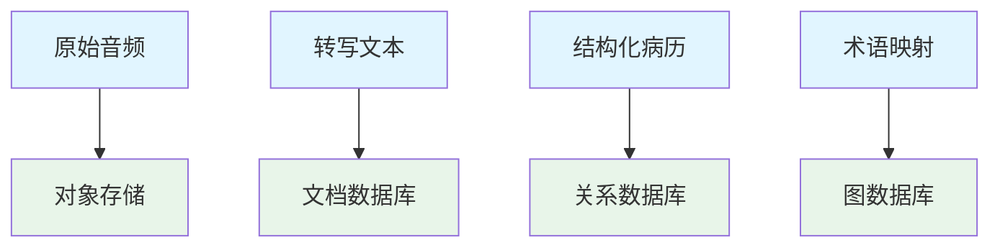

**存储方案：**

| 数据类型  | 存储系统       | 原因        |
| ----- | ---------- | --------- |
| 原始音频  | MinIO/OSS  | 大文件、对象存储  |
| 转写文本  | MongoDB    | 半结构化、灵活查询 |
| 结构化病历 | PostgreSQL | 结构化、事务支持  |
| 术语映射  | Neo4j      | 图结构、关系查询  |

### 5. 性能优化设计

#### 5.1 ASR性能优化

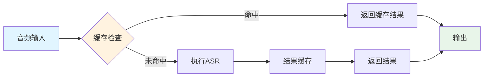

**优化策略：**

| 策略   | 方法        | 效果       |
| ---- | --------- | -------- |
| 模型缓存 | 预加载模型到内存  | 减少启动时间   |
| 结果缓存 | 缓存已识别音频结果 | 避免重复计算   |
| 批处理  | 批量处理多个音频段 | 提高GPU利用率 |
| 流式处理 | 实时处理音频流   | 降低延迟     |

#### 5.2 并发处理设计

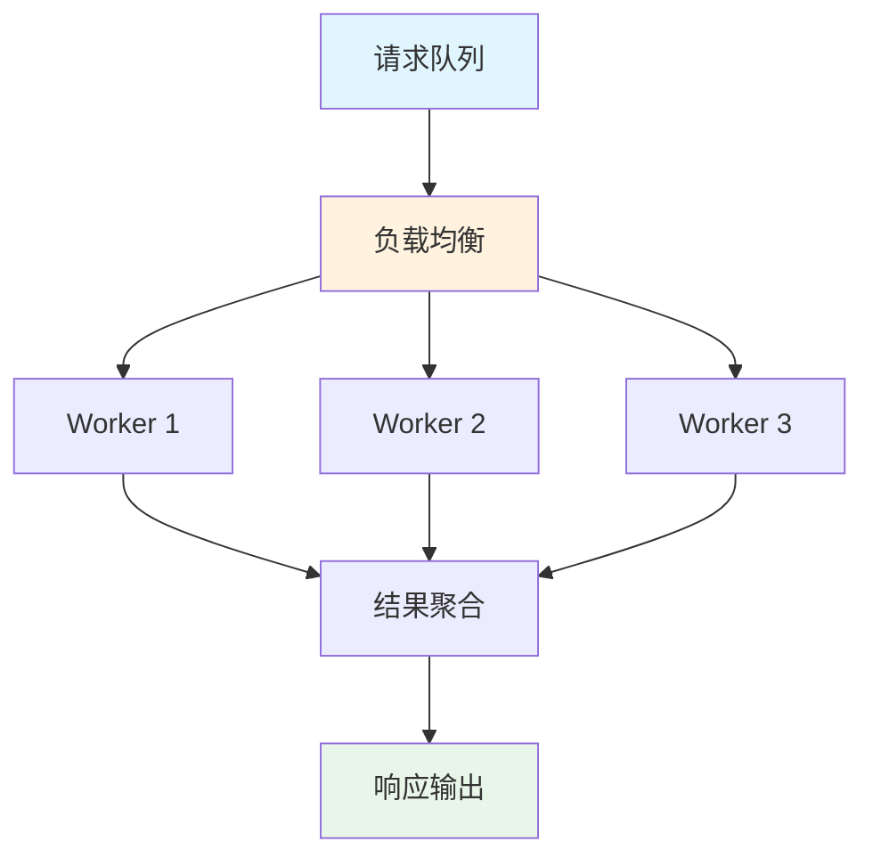

**并发配置：**

| 参数    | 值      | 说明      |
| ----- | ------ | ------- |
| 最大并发数 | CPU核心数 | 避免资源竞争  |
| 队列长度  | 100    | 限制排队请求  |
| 超时时间  | 30秒    | 避免长时间等待 |

### 6. 安全设计

#### 6.1 数据安全


**安全措施：**

| 层面   | 措施        | 实现        |
| ---- | --------- | --------- |
| 传输安全 | HTTPS/TLS | 加密传输通道    |
| 存储安全 | AES-256   | 加密存储数据    |
| 访问安全 | RBAC      | 基于角色的访问控制 |
| 审计安全 | 日志记录      | 记录所有操作    |

### 7. 监控与日志设计

#### 7.1 监控指标

```mermaid
graph TB
    A[系统监控] --> B[性能指标]
    A --> C[业务指标]
    A --> D[错误指标]
    
    B --> B1[ASR延迟]
    B --> B2[系统吞吐量]
    B --> B3[资源使用率]
    
    C --> C1[识别准确率]
    C --> C2[病历生成成功率]
    C --> C3[用户满意度]
    
    D --> D1[错误率]
    D --> D2[异常类型]
    D --> D3[告警触发]
    
    style A fill:#e1f5ff
    style B fill:#fff3e0
    style C fill:#fff3e0
    style D fill:#fff3e0
```

**关键指标：**

| 指标类别 | 指标名称  | 阈值    | 告警级别     |
| ---- | ----- | ----- | -------- |
| 性能   | ASR延迟 | < 2s  | Warning  |
| 性能   | 系统可用性 | > 99% | Critical |
| 业务   | 识别准确率 | > 95% | Warning  |
| 错误   | 错误率   | < 1%  | Critical |

## 模块说明

### 输入层

| 模块 | 职责 | 技术方案 | 实现状态 |
|------|------|----------|----------|
| 音频上传模块 | 接收音频文件上传 | FastAPI + multipart | ✅ 已实现 |
| ASR模块 | 语音转文字 | FunASR (Paraformer) | ✅ 已实现 |
| 说话人分离 | 区分医生/患者 | FunASR CAM++ | ✅ 已实现 |

### 处理层

| 模块 | 职责 | 技术方案 | 实现状态 |
|------|------|----------|----------|
| ASR后处理 | 医疗术语纠错 | 规则匹配 | ✅ 已实现 |
| 文本规范化 | 标点、说话人映射 | 正则表达式 | ✅ 已实现 |
| 证据选择模块 | 从对话中检索相关片段 | 触发词匹配 + LLM | ✅ 已实现 |
| 术语规范化模块 | 口语化表述映射到专业术语 | LLM识别 + UMLS检索 + LLM候选选择 | ✅ 已实现 |
| 病历要素抽取模块 | 从证据中抽取SOAP要素 | 规则抽取 + LLM | ✅ 已实现 |
| 病历生成模块 | 基于抽取结果生成结构化病历 | 模板生成 + LLM | ✅ 已实现 |
| 验证模块 | 检查病历完整性和术语正确性 | 字典匹配 + UMLS | ✅ 已实现 |

### 输出层

| 模块 | 职责 | 格式 | 实现状态 |
|------|------|------|----------|
| 转写结果展示 | 显示转写文本和说话人 | HTML/JSON | ✅ 已实现 |
| 结构化病历 | 最终输出的结构化医疗文档 | SOAP格式 | ✅ 已实现 |

### 外部依赖

| 资源 | 用途 | 状态 |
|------|------|------|
| FunASR模型 | ASR转写和说话人分离 | ✅ 已集成 |
| 医疗热词表 | 提升医疗术语识别率 | ✅ 已配置 |
| ASR纠正规则 | 医疗术语纠错 | ✅ 已配置 |
| 字段触发词表 | 证据选择触发词 | ✅ 已配置 |
| 医学术语词表 | 术语类型提示（仅用于LLM参考） | ✅ 已配置 |
| 医学本体库 (UMLS/SNOMED/ICD) | 术语规范化检索 | ✅ 已集成 |
| LLM API / 本地模型 | 结构化生成 | ✅ 已集成 |

## 后端服务架构

### API路由

| 路由 | 方法 | 功能 | 文件 |
|------|------|------|------|
| /api/upload | POST | 上传音频文件 | backend/api/upload.py |
| /api/asr/transcribe/{visit_id} | POST | 启动ASR转写任务 | backend/api/asr.py |
| /api/task/{task_id} | GET | 查询任务状态 | backend/api/task.py |
| /api/emr/process | POST | 处理就诊记录生成病历 | backend/api/emr.py |
| /api/emr/status/{visit_id} | GET | 查询病历处理状态 | backend/api/emr.py |
| /api/emr/record/{visit_id} | GET | 获取病历记录 | backend/api/emr.py |
| /api/emr/versions/{visit_id} | GET | 获取病历所有版本 | backend/api/emr.py |
| / | GET | 首页（上传界面） | backend/main.py |
| /health | GET | 健康检查 | backend/main.py |

### 数据模型

| 模型 | 表名 | 说明 | 文件 |
|------|------|------|------|
| Visit | visits | 就诊记录 | backend/models/visit.py |
| Task | tasks | 任务记录 | backend/models/task.py |
| TranscriptTurn | transcript_turns | 转写轮次 | backend/models/transcript.py |
| ASRCorrection | asr_corrections | ASR纠正记录 | backend/models/transcript.py |
| EvidenceSpan | evidence_spans | 证据片段 | backend/models/evidence.py |
| NormalizedTerm | normalized_terms | 规范化术语 | backend/models/term.py |
| ExtractedItem | extracted_items | 抽取的病历要素 | backend/models/extracted_item.py |
| EMRRecord | emr_records | 病历记录 | backend/models/emr_record.py |
| LLMConfig | llm_configs | LLM配置 | backend/models/llm_config.py |

#### TranscriptTurn 字段说明

| 字段 | 类型 | 说明 |
|------|------|------|
| turn_id | Integer | 主键，自增 |
| visit_id | String | 外键，关联就诊记录 |
| turn_index | Integer | 轮次索引 |
| speaker | String | 说话人ID（spk0, spk1等） |
| text | String | 转写文本 |
| original_text | String | 原始文本（纠错前） |
| corrected_text | String | 纠正后文本 |
| start_ms | Integer | 开始时间戳（毫秒） |
| end_ms | Integer | 结束时间戳（毫秒） |
| confidence | Float | ASR置信度（0.0-1.0），默认1.0 |
| created_at | DateTime | 创建时间 |

### 服务层

| 服务 | 功能 | 文件 |
|------|------|------|
| ASRService | 封装FunASR引擎，支持说话人分离和角色识别 | backend/services/asr_service.py |
| ASRPostprocessor | ASR后处理，医疗术语纠错 | backend/services/postprocessor.py |
| TranscriptNormalizer | 文本标准化，说话人映射 | backend/services/normalizer.py |
| SpeakerRoleClassifier | 说话人角色识别，基于语义分析识别医生/患者 | backend/services/speaker_role_classifier.py |
| EvidenceService | 证据选择，基于触发词、置信度和LLM筛选相关片段 | backend/services/evidence_service.py |
| TerminologyService | 术语规范化，LLM识别术语+UMLS检索+LLM候选选择，支持并行处理 | backend/services/terminology_service.py |
| TranslationService | 中英文翻译，使用专门翻译小模型提升翻译速度 | backend/services/translation_service.py |
| ExtractionService | 病历要素抽取，从证据中抽取SOAP要素 | backend/services/extraction_service.py |
| EMRGenerationService | 病历生成，基于模板和LLM生成结构化病历 | backend/services/emr_generation_service.py |
| MedicalRecordPipeline | 整合服务，串联所有处理步骤，支持并行处理 | backend/services/medical_record_pipeline.py |
| LLMPipelineService | 多阶段LLM处理，支持调试模式和并行优化 | backend/services/llm_pipeline_service.py |
| LLMPipelineServiceEnglish | 英文多阶段LLM处理，跳过翻译步骤优化 | backend/services/llm_pipeline_service_en.py |
| LLMService | LLM服务，支持多适配器和模板渲染 | backend/services/llm/llm_service.py |

### 配置项

| 配置项 | 默认值 | 说明 |
|--------|--------|------|
| APP_NAME | 中文门诊病历生成系统 | 应用名称 |
| DATABASE_URL | sqlite:///data/database/medical.db | 数据库连接 |
| ASR_ENGINE | funasr | ASR引擎类型 |
| ASR_DEVICE | cpu | 计算设备 |
| ENABLE_DIARIZATION | true | 启用说话人分离 |
| ENABLE_ROLE_CORRECTION | true | 启用说话人角色识别修正 |
| ENABLE_ASR_CORRECTION | true | 启用ASR纠错 |
| HOTWORD_PATH | config/hotwords_medical.txt | 热词表路径 |
| LLM_DEBUG_MODE | false | LLM调试模式开关 |
| LLM_SEGMENT_TURNS | 10 | LLM分段轮次数 |
| TRANSLATION_ENABLED | true | 启用翻译服务 |
| TRANSLATION_MODEL | Helsinki-NLP/opus-mt-zh-en | 翻译模型名称 |
| TRANSLATION_DEVICE | cpu | 翻译模型运行设备 |
| UMLS_MAX_CONCURRENT | 5 | UMLS API最大并发请求数 |
| TERMINOLOGY_PARALLEL_ENABLED | true | 启用术语规范化并行模式 |

## 依赖关系

### 核心依赖

| 依赖 | 版本 | 用途 |
|------|------|------|
| fastapi | ^0.104.0 | Web框架 |
| uvicorn | ^0.24.0 | ASGI服务器 |
| sqlalchemy | ^2.0.0 | ORM框架 |
| funasr | ^1.0.0 | ASR引擎 |
| torch | ^2.0.0 | 深度学习框架 |
| transformers | ^4.35.0 | 翻译模型 |
| openai | ^1.3.0 | LLM API |
| requests | ^2.31.0 | HTTP客户端 |
| pydantic | ^2.5.0 | 数据验证 |
| asyncio | 内置 | 异步编程 |
| concurrent.futures | 内置 | 线程池执行 |

### 性能优化依赖

| 依赖 | 版本 | 用途 |
|------|------|------|
| asyncio | 内置 | 异步编程，并行处理 |
| ThreadPoolExecutor | 内置 | 线程池，解决事件循环嵌套问题 |

## 性能优化

### 并行处理架构

病历生成流程支持并行处理，主要优化点：

1. **步骤级并行**：证据选择和术语规范化并行执行
2. **批量处理**：批量翻译、批量UMLS检索、批量LLM选择
3. **并行Code获取**：使用asyncio.gather并行获取所有术语的code
4. **术语去重**：避免重复处理相同术语
5. **条件性跳过**：无数据时跳过相关步骤
6. **英文优化**：跳过翻译步骤，直接使用英文术语

### 性能对比

| 服务 | 优化前 | 优化后 | 提升 |
|------|--------|--------|------|
| 中文服务 | 串行处理 | 并行处理 | 减少30-50% |
| 英文服务 | 串行处理 | 并行处理（跳过翻译） | 减少40-60% |

### 并行处理流程图

```mermaid
graph TB
    A[对话文本] --> B[证据选择]
    A --> C[术语规范化]
    B --> D[要素抽取]
    C --> D
    D --> E[病历生成]
    
    style B fill:#fff3e0
    style C fill:#fff3e0
    style D fill:#e8f5e9
    style E fill:#e8f5e9
```

### 异步执行解决方案

在FastAPI环境中，使用`run_async`辅助函数处理异步代码：

```python
def run_async(coro):
    """
    在同步上下文中运行异步协程
    
    解决问题：在FastAPI的事件循环中不能使用asyncio.run()
    """
    try:
        loop = asyncio.get_running_loop()
    except RuntimeError:
        loop = None
    
    if loop and loop.is_running():
        with ThreadPoolExecutor(max_workers=1) as executor:
            future = executor.submit(asyncio.run, coro)
            return future.result()
    else:
        return asyncio.run(coro)
```

## 前端界面

### 页面结构

| 页面 | 文件 | 功能 |
|------|------|------|
| 上传页面 | frontend/index.html | 音频上传、表单填写、进度显示 |
| 结果页面 | frontend/result.html | 转写结果展示、状态刷新、说话人区分 |

### 样式与脚本

| 文件 | 功能 |
|------|------|
| frontend/css/style.css | 全局样式、响应式布局 |
| frontend/js/upload.js | 上传逻辑、拖拽处理、进度更新 |
| frontend/js/result.js | 结果展示、状态轮询、说话人渲染 |

### 用户流程

1. 访问首页 → 拖拽或选择音频文件
2. 填写患者信息（可选）→ 点击上传
3. 自动跳转结果页 → 点击开始转写
4. 等待转写完成 → 查看说话人分离结果

## 数据流程

### 标准流程

```mermaid
graph LR
    A[音频输入] --> B[ASR转写]
    B --> C[说话人分离]
    C --> D[角色识别]
    D --> E[证据选择]
    E --> F[术语规范化]
    F --> G[要素抽取]
    G --> H[病历生成]
    H --> I[病历输出]
```

### 并行处理流程

```mermaid
graph TB
    A[对话文本] --> B[证据选择]
    A --> C[术语规范化]
    B --> D[要素抽取]
    C --> D
    D --> E[病历生成]
    
    style B fill:#fff3e0
    style C fill:#fff3e0
    style D fill:#e8f5e9
    style E fill:#e8f5e9
```

**并行处理说明**：

1. **证据选择和术语规范化并行执行**：两个步骤无数据依赖，可同时进行
2. **术语规范化内部并行**：
   - 批量翻译（中文服务）
   - 并行UMLS检索
   - 批量LLM选择
   - 并行获取Code
3. **条件性跳过**：
   - 无对话轮次时跳过证据选择和术语规范化
   - 无证据时跳过要素抽取
   - 无术语时跳过术语规范化

### 英文服务流程

英文病历生成服务跳过翻译步骤：

```mermaid
graph LR
    A[英文对话] --> B[证据选择]
    A --> C[术语规范化<br/>跳过翻译]
    B --> D[要素抽取]
    C --> D
    D --> E[病历生成]
```

## ASR 模块架构

### 设计原则

- **单一职责**：每个引擎类只负责一种 ASR 模型
- **开闭原则**：通过继承 `ASRBase` 扩展新引擎，无需修改现有代码
- **依赖倒置**：上层代码依赖抽象接口 `ASRBase`，而非具体实现

### 类图

```
┌─────────────────────────────────────────────────────────────┐
│                        ASRBase (抽象类)                      │
├─────────────────────────────────────────────────────────────┤
│ + model_name: str                                           │
│ + device: str                                               │
│ + load_model() -> None                                      │
│ + transcribe(audio_path) -> ASRResult                       │
│ + is_loaded() -> bool                                       │
└─────────────────────────────────────────────────────────────┘
                              ▲
                              │ 继承
              ┌───────────────┴───────────────┐
              │                               │
┌─────────────────────────┐     ┌─────────────────────────┐
│     FunASREngine        │     │      MedASREngine       │
├─────────────────────────┤     ├─────────────────────────┤
│ - model_id: str         │     │ - model_id: str         │
│ - vad_model: str        │     │ - _processor            │
│ - punc_model: str       │     │ - _model                │
│ - hotword_path: str     │     │                         │
├─────────────────────────┤     ├─────────────────────────┤
│ + load_model()          │     │ + load_model()          │
│ + transcribe()          │     │ + transcribe()          │
│ + create_medical_version│     │ + transcribe_with_warning│
└─────────────────────────┘     └─────────────────────────┘

┌─────────────────────────────────────────────────────────────┐
│                      ASRFactory (工厂类)                    │
├─────────────────────────────────────────────────────────────┤
│ - _registry: dict[str, type[ASRBase]]                       │
├─────────────────────────────────────────────────────────────┤
│ + create(engine_type) -> ASRBase                            │
│ + create_all() -> dict[str, ASRBase]                        │
│ + register(name, engine_class) -> None                      │
│ + list_available() -> list[str]                             │
└─────────────────────────────────────────────────────────────┘

┌─────────────────────────────────────────────────────────────┐
│                      ASRResult (数据类)                     │
├─────────────────────────────────────────────────────────────┤
│ + text: str                                                 │
│ + language: str                                             │
│ + duration_seconds: float                                   │
│ + inference_time: float                                     │
│ + model_name: str                                           │
│ + real_time_factor: float (计算属性)                         │
└─────────────────────────────────────────────────────────────┘
```

### 模块依赖关系

```
compare_asr.py (脚本层)
       │
       ▼
   factory.py (工厂层)
       │
       ├──────────┬──────────┐
       ▼          ▼          │
funasr_engine  medasr_engine │
       │          │          │
       └──────────┴──────────┘
                  │
                  ▼
             base.py (抽象层)
```

## 使用方式

### 基础用法

```python
from src.asr import ASRFactory

# 创建单个引擎
engine = ASRFactory.create("funasr", device="cpu")
engine.load_model()
result = engine.transcribe("audio.wav")
print(result.text)
```

### 对比测试

```bash
# 测试所有引擎
python scripts/compare_asr.py --audio test.wav --device cpu

# 只测试 FunASR
python scripts/compare_asr.py --audio test.wav --engine funasr

# 使用医疗热词
python scripts/compare_asr.py --audio test.wav --hotword config/hotwords_medical.txt
```

### 扩展新引擎

```python
from src.asr import ASRBase, ASRResult, ASRFactory

class WhisperEngine(ASRBase):
    def __init__(self, device="cpu"):
        super().__init__("Whisper", device)
    
    def load_model(self):
        # 加载模型逻辑
        pass
    
    def transcribe(self, audio_path, **kwargs) -> ASRResult:
        # 转写逻辑
        pass

# 注册到工厂
ASRFactory.register("whisper", WhisperEngine)
```

