# ASR模块测试指南

## 测试流程概览

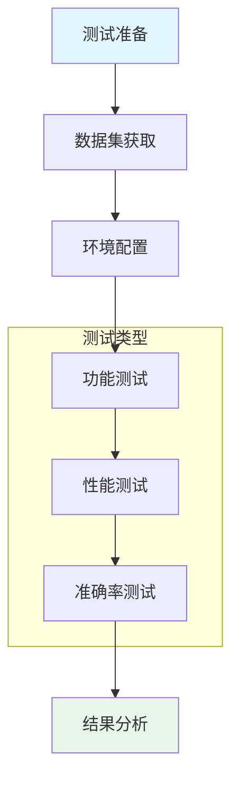

## 1. 测试方法

### 1.1 测试类型划分

| 测试类型 | 目的 | 方法 | 适用场景 |
|---------|------|------|---------|
| 功能测试 | 验证基本功能正常 | 端到端转写测试 | 开发阶段、集成测试 |
| 性能测试 | 测量处理速度和资源占用 | RTF、延迟、内存监控 | 性能优化、部署评估 |
| 准确率测试 | 评估识别精度 | CER/WER计算 | 模型评估、论文实验 |
| 回归测试 | 确保修改后功能正常 | 自动化测试脚本 | 代码修改后 |

### 1.2 功能测试方法

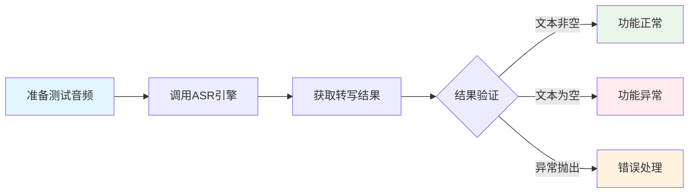

**测试步骤**：

1. **环境检查**
   - 确认FunASR已安装：`pip show funasr`
   - 确认模型缓存目录正确
   - 确认音频处理库可用

2. **模型加载测试**
   - 加载Paraformer模型
   - 加载VAD模型
   - 加载标点恢复模型

3. **音频转写测试**
   - 测试短音频（< 30秒）
   - 测试长音频（≥ 30秒）
   - 测试不同采样率音频
   - 测试多声道音频

**执行命令**：

```bash
python tests/test_asr_quick.py
```

### 1.3 性能测试方法

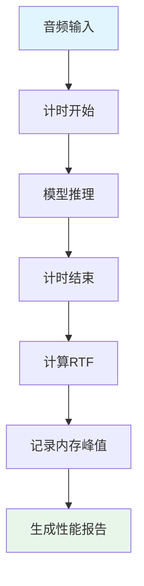

**性能指标测量方法**：

| 指标 | 测量方法 | 计算公式 |
|-----|---------|---------|
| RTF | 推理时间/音频时长 | RTF = inference_time / audio_duration |
| 首字延迟 | 从开始到首个字符输出 | 需流式模式支持 |
| 内存峰值 | 进程内存监控 | 使用psutil库 |
| GPU利用率 | GPU监控工具 | nvidia-smi或pynvml |

**性能测试脚本示例**：

```python
import time
import psutil
from src.asr.factory import ASRFactory

def measure_performance(audio_path: str):
    process = psutil.Process()
    mem_before = process.memory_info().rss / 1024 / 1024
    
    asr = ASRFactory.create("funasr", device="cpu")
    asr.load_model()
    
    mem_after_load = process.memory_info().rss / 1024 / 1024
    
    start = time.perf_counter()
    result = asr.transcribe(audio_path)
    end = time.perf_counter()
    
    mem_after_infer = process.memory_info().rss / 1024 / 1024
    
    return {
        "rtf": (end - start) / result.duration_seconds,
        "inference_time": end - start,
        "model_memory_mb": mem_after_load - mem_before,
        "peak_memory_mb": mem_after_infer - mem_before
    }
```

### 1.4 准确率测试方法

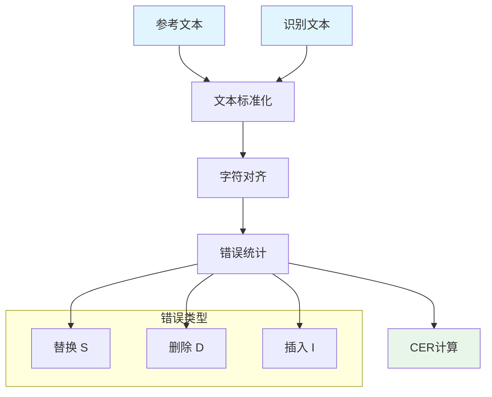

**CER计算公式**：

$$CER = \frac{S + D + I}{N}$$

其中：

- S：替换错误数
- D：删除错误数
- I：插入错误数
- N：参考文本总字符数

**文本标准化规则**：

| 处理项 | 处理方法 |
|-------|---------|
| 标点符号 | 移除所有中英文标点 |
| 空白字符 | 移除所有空格、制表符 |
| 大小写 | 中文不处理，英文转小写 |
| 数字 | 保留原样 |

**CER计算实现**：

```python
import difflib
import re

def calculate_cer(reference: str, hypothesis: str) -> float:
    def normalize(text: str) -> str:
        return re.sub(r'[，。！？、；：""''（）【】《》\s,.!?;:\'"()\[\]<>]', '', text)
    
    ref_chars = list(normalize(reference))
    hyp_chars = list(normalize(hypothesis))
    
    if len(ref_chars) == 0:
        return 0.0
    
    matcher = difflib.SequenceMatcher(None, ref_chars, hyp_chars)
    
    s = d = i = 0
    for tag, i1, i2, j1, j2 in matcher.get_opcodes():
        if tag == 'replace':
            s += max(i2 - i1, j2 - j1)
        elif tag == 'delete':
            d += (i2 - i1)
        elif tag == 'insert':
            i += (j2 - j1)
    
    return (s + d + i) / len(ref_chars)
```

## 2. 测试指标

### 2.1 指标体系

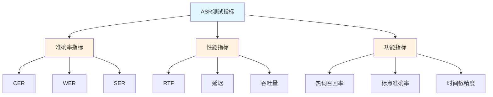

### 2.2 准确率指标详解

| 指标 | 全称 | 计算方式 | 适用场景 |
|-----|------|---------|---------|
| CER | Character Error Rate | 字符级别错误率 | 中文语音识别 |
| WER | Word Error Rate | 词级别错误率 | 英文语音识别 |
| SER | Sentence Error Rate | 句子级别错误率 | 整体评估 |

**CER与WER对比**：

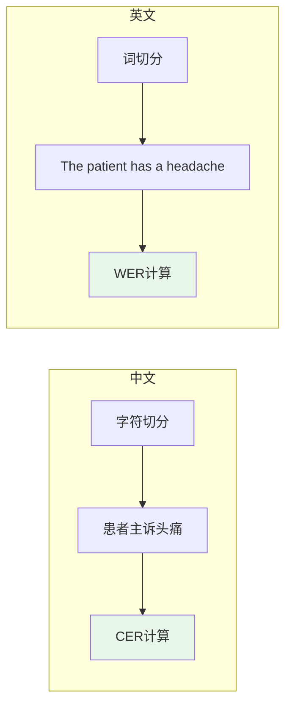

### 2.3 性能指标详解

| 指标 | 定义 | 合格标准 | 优秀标准 |
|-----|------|---------|---------|
| RTF | 实时因子 | < 1.0 | < 0.3 |
| 首字延迟 | 首个字符输出时间 | < 500ms | < 200ms |
| 内存占用 | 模型加载后内存 | < 4GB | < 2GB |
| GPU显存 | 模型显存占用 | < 8GB | < 4GB |

**RTF含义**：

- RTF < 1.0：处理速度快于实时（可用于实时转写）
- RTF = 1.0：处理速度等于实时
- RTF > 1.0：处理速度慢于实时（仅适用于离线处理）

### 2.4 功能指标详解

| 指标 | 定义 | 测量方法 |
|-----|------|---------|
| 热词召回率 | 热词正确识别比例 | 热词正确数/热词总数 |
| 标点准确率 | 标点位置正确比例 | 正确标点数/总标点数 |
| 时间戳精度 | 时间戳与实际时间偏差 | 平均偏差毫秒数 |

## 3. 小型数据集获取方法

### 3.1 数据集选择标准

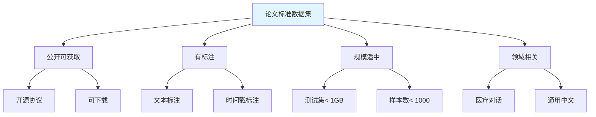

### 3.2 推荐数据集

#### 3.2.1 AISHELL-1（推荐）

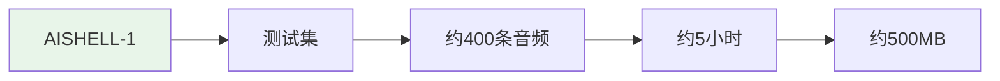

| 属性 | 值 |
|-----|---|
| 来源 | 北京希尔贝克公司 |
| 规模 | 测试集约400条，5小时 |
| 大小 | 约500MB |
| 内容 | 通用中文语音 |
| 标注 | 文本转录 |
| 获取方式 | 开源下载 |

**获取方法**：

```bash
# 方法1：使用ModelScope下载
pip install modelscope
python -c "from modelscope.msdatasets import MsDataset; ds = MsDataset.load('speech_asr_aishell1')"

# 方法2：官网申请
# 访问：http://www.openslr.org/33/
```

#### 3.2.2 AISHELL-2（备选）

| 属性 | 值 |
|-----|---|
| 规模 | 测试集约5000条 |
| 大小 | 约2GB |
| 内容 | 通用中文语音 |
| 获取方式 | 需签署协议 |

#### 3.2.3 WenetSpeech（大规模备选）

| 属性 | 值 |
|-----|---|
| 规模 | 10000+小时 |
| 内容 | 中文演讲、访谈 |
| 获取方式 | 开源下载 |

### 3.3 医疗领域数据集

#### 3.3.1 MMedFD

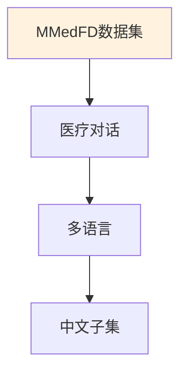

| 属性 | 值 |
|-----|---|
| 内容 | 医疗对话语音 |
| 语言 | 多语言（含中文） |
| 获取方式 | 学术申请 |

#### 3.3.2 合成医疗数据（本项目方案）

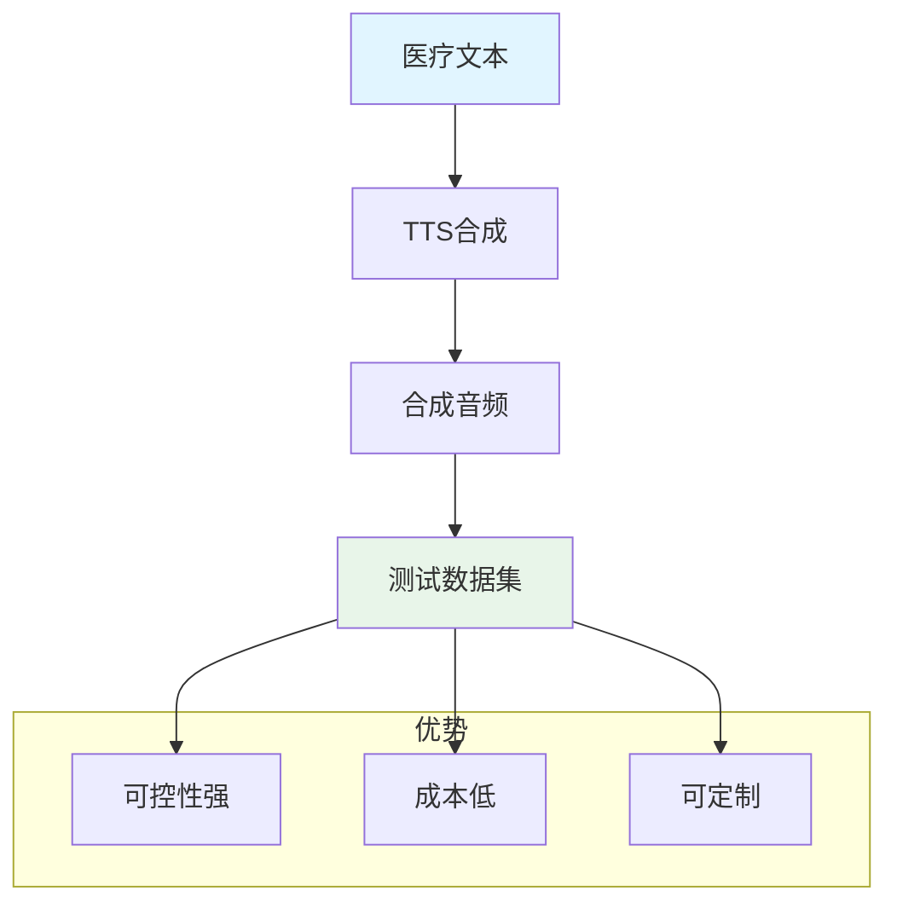

**合成数据生成方法**：

```python
import edge_tts
import asyncio

async def synthesize_medical_audio(text: str, output_path: str):
    communicate = edge_tts.Communicate(text, "zh-CN-XiaoxiaoNeural")
    await communicate.save(output_path)

# 批量合成
test_texts = [
    "患者主诉头痛三天伴有发热",
    "建议服用布洛芬退烧",
    "高血压患者需要定期测量血压"
]

for i, text in enumerate(test_texts):
    asyncio.run(synthesize_medical_audio(text, f"test_{i}.wav"))
```

### 3.4 数据集准备流程

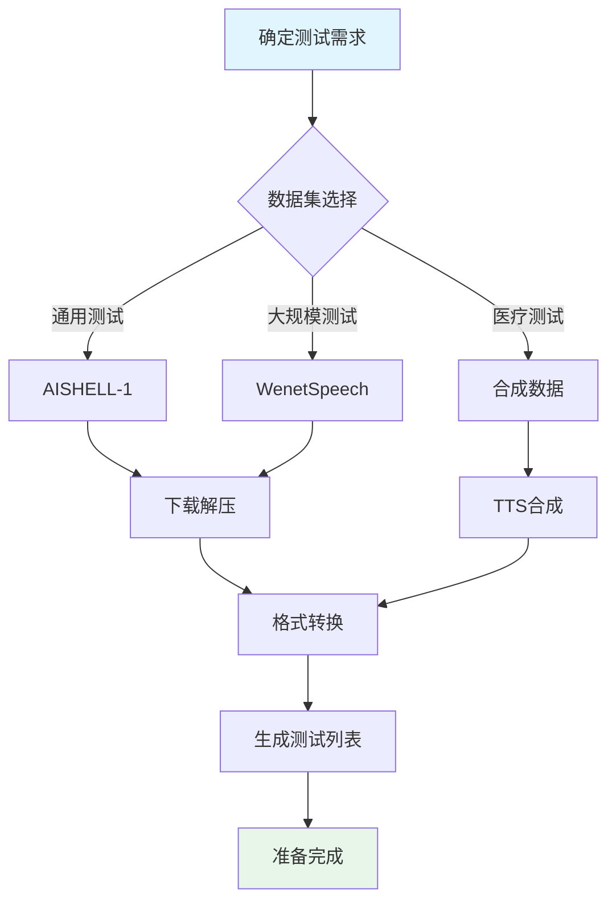

### 3.5 测试数据集规模建议

| 测试目的 | 推荐样本数 | 音频总时长 | 存储空间 |
|---------|----------|-----------|---------|
| 快速验证 | 10-20条 | 1-2分钟 | < 10MB |
| 功能测试 | 50-100条 | 10-20分钟 | < 100MB |
| 准确率评估 | 200-500条 | 1-3小时 | 200-500MB |
| 论文实验 | 500-1000条 | 3-5小时 | 500MB-1GB |

## 4. 测试执行流程

### 4.1 完整测试流程

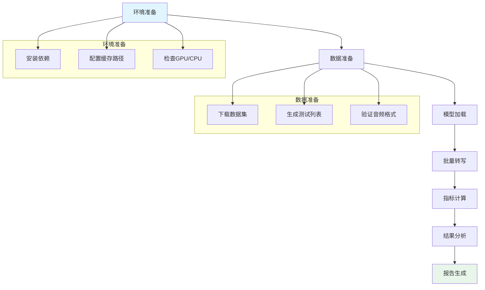

### 4.2 测试结果记录格式

| 字段 | 类型 | 说明 |
|-----|------|------|
| test_id | string | 测试用例ID |
| audio_path | string | 音频文件路径 |
| reference | string | 参考文本 |
| hypothesis | string | 识别文本 |
| cer | float | 字符错误率 |
| rtf | float | 实时因子 |
| inference_time | float | 推理时间(秒) |
| audio_duration | float | 音频时长(秒) |

### 4.3 测试报告模板

```markdown
# ASR模块测试报告

## 测试环境
- 操作系统：Windows 11
- Python版本：3.13
- FunASR版本：x.x.x
- 设备：CPU/GPU

## 测试数据集
- 数据集名称：AISHELL-1
- 样本数量：400
- 总时长：5小时

## 测试结果

### 准确率指标
| 指标 | 值 |
|-----|---|
| 平均CER | x.xx% |
| CER标准差 | x.xx% |

### 性能指标
| 指标 | 值 |
|-----|---|
| 平均RTF | x.xxx |
| 平均推理时间 | x.xx秒 |
| 内存占用 | xxx MB |

### 错误分析
- 主要错误类型
- 医疗术语识别情况
- 改进建议
```

## 5. 现有测试脚本使用说明

### 5.1 快速测试脚本

**文件位置**：`tests/test_asr_quick.py`

**功能**：使用预设文本进行快速验证

**执行方式**：

```bash
python tests/test_asr_quick.py
```

**输出内容**：

- 模型加载状态
- 各测试用例识别结果
- CER统计
- 平均推理时间

### 5.2 一键测试脚本

**文件位置**：`tests/test_asr_oneclick.py`

**功能**：自动合成音频并测试

**依赖**：

- edge-tts（用于音频合成）
- ffmpeg（用于音频处理）

**执行方式**：

```bash
python tests/test_asr_oneclick.py
```

**执行流程**：


## 6. 注意事项

### 6.1 测试环境配置

- 模型缓存路径需正确设置
- 首次运行需下载模型（约2GB）
- 建议使用CPU模式进行稳定性测试
- GPU模式需确认CUDA配置正确

### 6.2 数据集使用规范

- 遵守数据集开源协议
- 论文中需正确引用数据集来源
- 医疗数据需注意隐私保护
- 合成数据需标注来源

### 6.3 结果解读

- CER受数据集领域影响较大
- 医疗术语CER通常高于通用文本
- RTF受硬件配置影响
- 建议多次测试取平均值
