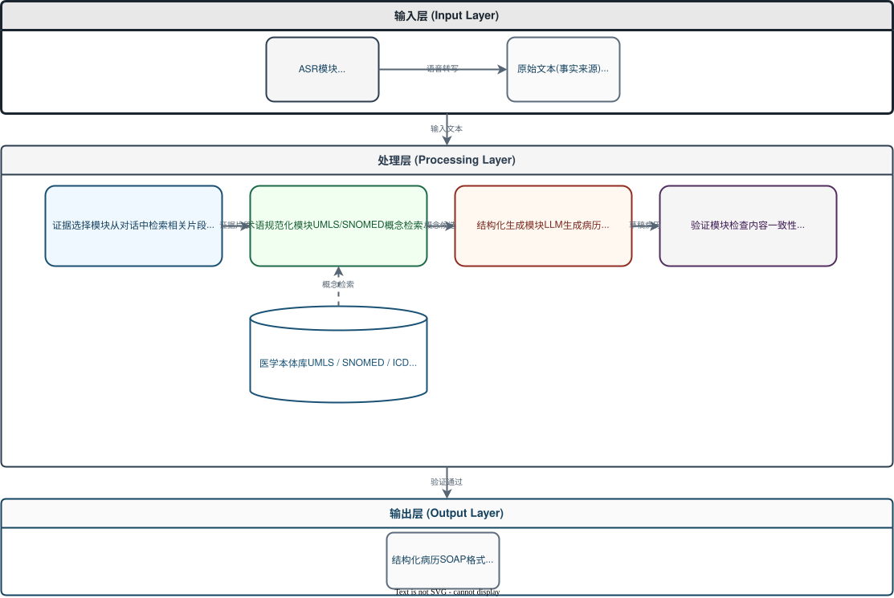

# 中文门诊病历生成系统 - 导师汇报演讲稿

> 汇报人：[你的姓名]
> 汇报时间：2026年4月
> 项目阶段：ASR转写模块 + Web应用框架（已完成）

---

## 第一部分：项目概述（2分钟）

各位老师好，我汇报的项目是"中文门诊病历生成系统"。

### 项目背景

门诊医生需要边问诊边记录病历，注意力被分散，问诊效率下降。这个项目的目标是把医患对话的语音自动转成结构化病历，格式采用SOAP。

### 核心流程

```
音频输入 → 语音识别 → 说话人分离 → 医疗纠错 → 结构化病历生成
```

### 当前完成状态

系统已经搭完基础框架，跑通了"音频上传 → 语音识别 → 说话人分离 → 医疗纠错 → Web展示"这条完整链路。

具体包括：
- 4个后端API接口（上传、转写、任务查询、结果获取）
- 4个数据库模型（就诊、任务、转写轮次、纠错记录）
- 2个前端页面（上传页、结果页）
- ASR引擎实现（FunASR）
- 少量医疗术语热词表，配套纠错规则库


## 第二部分：调研与整体架构（5分钟）

### 2.1 研究背景

门诊问诊场景中，医生需要在有限时间内同时完成问诊、判断和病历书写。录音自动转写与结构化病历生成有望显著降低文书负担，但真正落地的难点在于把口语、噪声和非标准表达稳定地转成可用的医学术语。

现有研究已经证明，从医患对话生成临床记录是可行的，但医疗场景对事实一致性、关键遗漏和术语准确性要求远高于通用摘要任务。尤其在中文门诊场景中，患者常用口语描述症状，医生口述中又包含大量低频专科词、药名和检查名，这使得自动语音识别与大模型生成都容易出现术语错误和幻觉。

### 2.2 国内外研究现状

#### 端到端病历生成

国际上，医疗自动记录系统的研究已形成较清晰的路线。SOAP note生成工作表明，按章节拆分的模块化摘要比纯抽象式生成更稳健。中文场景中，MIE、SAFE等工作主要聚焦于医疗对话信息抽取，EMRModel则展示了将对话直接映射到结构化病历模板的可行性。

#### 医疗ASR与术语纠错

医疗录音中的低频术语识别是系统成败的前置条件。ASR-EC Benchmark证明，仅靠提示词让大模型做中文ASR纠错效果有限，容易出现过度纠正。在专科词识别方面，post-decoder biasing通过加权词表增强稀有医学词识别，对低频词的错误率有明显改善。

#### 医学术语标准化与降幻觉

医学术语纠错的目的不应只是把错字改对，而应把转写结果映射为标准术语。MCSCSet证明医学领域拼写纠错与开放领域差异很大，通用中文纠错模型迁移到医学场景会显著退化。在降幻觉方面，Re3Writer提出的retrieve-reason-refine框架说明，检索相似病例和引入医学知识约束，可以提升临床文本生成的忠实度与完整性。

### 2.3 研究目标与核心问题

本课题拟构建一个面向中文通用门诊问诊录音的AI问诊助手，完成以下目标：

- 将医患录音自动转写为带说话人信息的对话文本
- 从对话中抽取主诉、现病史、既往史、检查建议、用药信息等病历要素
- 将口语化和误转写的医学表达纠正并规范化为标准医学术语
- 生成结构化病历，并对关键术语给出检索校验与证据约束

围绕上述目标，课题聚焦以下核心问题：

1. 如何在门诊录音噪声、多说话人交互和低频医学词条件下，提高关键术语的识别率
2. 如何将ASR输出中的错词、同音词和非标准口语表达映射到标准医学术语
3. 如何在结构化病历生成过程中抑制幻觉，并减少关键医疗事实遗漏
4. 如何设计既适合工程实现又能反映临床可用性的实验方案与评价指标

### 2.4 整体技术路线

系统采用三阶段流水线，并在第二阶段与第三阶段之间加入术语校验闭环：

| 模块 | 输入 | 输出 | 关键方法 |
|:---|:---|:---|:---|
| 医疗ASR | 门诊录音 | 带说话人标签的转写文本 | 医疗加权词表、置信度、n-best候选 |
| 术语纠错与标准化 | ASR文本与候选词 | 标准化医学术语序列 | 词典检索、拼音匹配、候选约束、实体链接 |
| 结构化病历生成 | 纠错后对话与病历模板 | 结构化病历 | 大模型抽取生成、章节约束、检索校验 |
| 错误检测与回写 | 初版病历与证据库 | 修正后病历与证据说明 | 错误检测、候选比对、事实校验 |

### 2.5 核心创新点

1. 围绕"术语纠错与降幻觉"构建系统主线，而不是把它作为附属后处理
2. 提出面向中文门诊录音的受限候选医学术语纠错机制
3. 将术语纠错与术语标准化集成到同一流程中
4. 在结构化病历生成后加入检索校验和错误回写机制

---

## 第三部分：架构细化与系统设计（5分钟）

### 3.1 整体架构设计

系统采用分层架构设计，分为三层：



**输入层（Input Layer）**：

- ASR模块：负责将语音信号转换为文本，支持实时转写和批量处理
- 原始文本：作为事实来源，保存完整的对话内容

**处理层（Processing Layer）**：

- 证据选择模块：从对话文本中检索与病历生成相关的片段
- 术语规范化模块：将口语化表达映射到标准医学术语
- 结构化生成模块：基于LLM生成符合SOAP格式的结构化病历
- 验证模块：检查生成病历的内容一致性
- 医学本体库：存储标准医学术语和概念

**输出层（Output Layer）**：

- 结构化病历：最终输出的SOAP格式病历文档

分层的好处是职责清晰，每层只关注自己的任务。可以单独优化某一层，比如替换ASR引擎。后续接入新引擎也比较方便。

### 3.2 ASR模块架构：工厂模式+策略模式

这是系统的核心模块，采用工厂模式加策略模式：

```
┌─────────────────────────────────────────┐
│         ASRBase (抽象基类)              │
│  + load_model()                         │
│  + transcribe() → ASRResult             │
└─────────────────────────────────────────┘
              ▲
      ┌───────┴───────┐
      │               │
┌─────────────┐ ┌─────────────┐
│ FunASREngine│ │ MedASREngine│
│  (中文)     │ │  (英文)     │
└─────────────┘ └─────────────┘
              ▲
              │
┌─────────────────────────────────────────┐
│       ASRFactory (工厂类)               │
│  + create("funasr") → FunASREngine      │
│  + register("whisper", WhisperEngine)   │
└─────────────────────────────────────────┘
```

为什么用工厂模式加策略模式：

- ASRBase定义统一接口（load_model和transcribe），上层代码只依赖抽象接口
- 每个具体引擎（FunASREngine、MedASREngine）实现自己的转写逻辑
- ASRFactory统一管理引擎创建，通过配置项动态切换

设计原则：

- 单一职责：每个引擎只负责一种ASR模型
- 开闭原则：扩展新引擎无需修改现有代码
- 依赖倒置：上层依赖抽象接口，而非具体实现

后续如果要接入Whisper或Qwen3 ASR，只需：

1. 继承ASRBase实现新引擎的load_model和transcribe方法
2. 通过ASRFactory.register注册新引擎
3. 修改配置项中的ASR_ENGINE名称即可，不用动其他代码

这样做的好处是技术选型验证时可以快速切换引擎对比效果，不需要改业务代码。

### 3.3 技术栈选型权衡

#### 后端：为什么选FastAPI而非Flask？

| 对比维度 | FastAPI | Flask |
|---------|---------|-------|
| 异步支持 | 原生支持 | 需额外配置 |
| 类型提示 | 强制类型提示 | 可选 |
| 自动文档 | Swagger + ReDoc | 需插件 |
| 性能 | 好 | 一般 |

FastAPI类型提示友好，自动API文档，异步支持好，适合快速开发。特别是ASR转写是耗时操作，需要异步任务支持，FastAPI原生asyncio集成更顺畅。

#### 数据库：为什么选SQLite而非PostgreSQL？

| 对比维度 | SQLite | PostgreSQL |
|---------|--------|-----------|
| 安装部署 | 零配置，单文件 | 需安装服务 |
| 性能 | 单机可用 | 高并发 |
| 适用场景 | 单机部署、开发测试 | 生产环境、多用户 |

当前是单机部署、单人使用，SQLite轻量级，不需要额外安装。后续如果需要可以迁移到PostgreSQL。SQLite的ACID特性也足够满足数据一致性要求。

#### 前端：为什么用HTML而非React？

这个阶段重点是验证ASR转写效果和医疗纠错准确性，HTML加JS够用，不需要复杂的状态管理。后续如果需要复杂交互，可以升级为React或Vue。

### 3.4 ASR数据流程设计

```
音频输入 → 预处理 → VAD切分 → ASR转写 → 标点恢复 → 热词增强 → 文本输出
   ↓          ↓         ↓          ↓          ↓          ↓
  WAV/MP3   16kHz    >30s分段   Paraformer  CT-Punc   SeACo热词
           单声道    <30s直接    字级置信度   标点插入   概率提升
```

关键设计决策的依据：

1. 音频预处理标准化有三个步骤：
   - 重采样到16kHz：因为FunASR的Paraformer模型训练时用的是16kHz采样率，这是模型预期的输入格式。如果输入48kHz或8kHz，模型识别率会下降
   - 转单声道：门诊录音可能是双声道（医生患者各一个声道），但ASR模型只接受单声道输入。合并声道后才能做说话人分离
   - 音量归一化：不同设备录制的音量差异很大，归一化到-3dB可以避免过爆或过弱的音频影响识别

2. VAD自动切分长音频：静音超过500ms切分，单段不超过30s。Paraformer模型对长音频的显存占用线性增长，30秒音频约需2GB显存。切分后可以控制内存占用，同时避免长序列导致的注意力分散

3. 热词增强机制：新概率 = 原概率 × (1 + 权重/100)。权重50表示原概率提升50%，这是FunASR文档推荐的平衡值，过高会导致模型过度偏向热词

### 3.5 说话人分离策略

当前已集成FunASR CAM++专业说话人分离模型，支持声纹识别区分医生和患者。

实现方式：

- 在FunASR引擎配置中启用 `spk_model="cam++"`
- CAM++（Context-Aware Masking，上下文感知掩码）是一种声纹识别模型，通过提取每段音频的"声纹特征"来区分不同说话人
- 模型自动识别不同说话人，输出 `spk0`、`spk1` 等标识
- 后端服务将 `spk0` 映射为医生，`spk1` 映射为患者

为什么选CAM++：

- 轻量化：模型仅2.5MB，推理速度快
- 准确率高：在VoxCeleb上EER仅0.79%
- 与FunASR无缝集成，无需额外部署

兜底方案：

- 如果CAM++未输出说话人信息（如音频过短），降级为交替映射策略
- 偶数段归为医生，奇数段归为患者
- 确保系统在任何情况下都能输出结果

---

## 第四部分：ASR模块实现与技术选型（5分钟）

### 4.1 调研方法

项目启动时，我对比了6种ASR方案，整理成技术选型文档（放在`docs/技术选型文档.md`，约6000字）。

对比的6种方案：

1. FunASR（阿里巴巴）
2. WeNet 2.0（有道/小米）
3. Qwen3 ASR（阿里巴巴）
4. FireRedASR（小红书）
5. MedASR（谷歌，医疗专用）
6. Whisper（OpenAI）

### 4.2 对比维度

我从5个维度做了分析：

#### 维度1：中文识别准确率

| 模型 | AISHELL-1 CER | AISHELL-2 CER | WenetSpeech Meeting CER |
|------|---------------|---------------|------------------------|
| Paraformer Large (FunASR) | 1.95% | 2.85% | 6.97% |
| Qwen3 ASR 1.7B | - | 2.71% | 5.88% |
| FireRedASR LLM | - | - | 平均3.05% |
| WeNet U2++ | 4.63% | 5.39% | - |
| Whisper Large v2 | - | - | 约13.8% |

FunASR在干净语音上表现最好，Qwen3 ASR在复杂场景略占优。

#### 维度2：流程完整性

| 流程环节 | FunASR | WeNet | Qwen3 | FireRed | Whisper |
|---------|--------|-------|-------|---------|---------|
| 语音活动检测(VAD) | 有 | 有 | 无 | 无 | 无 |
| 标点恢复 | 有 | 有 | 无 | 无 | 无 |
| 热词定制 | 有 | 无 | 有限 | 无 | 有限 |
| 说话人分离 | 有 | 有 | 无 | 无 | 无 |

FunASR是唯一提供完整流水线的方案，其他方案需要自己拼组件。

#### 维度3：医疗场景适配能力

热词定制效果：

| 方案 | 热词技术 | 术语召回提升 |
|------|---------|-------------|
| FunASR | SeACo Paraformer | F1: 27 → 85 |
| WeNet | 上下文偏置 | CER: 14.94 → 6.17 |
| Whisper | 有限支持 | 未公开 |

医疗对话的难点在于患者侧WER高达53.11%，而医生侧只有1.84%。主要困难是重叠、打断、回声、远场和说话人切换。FunASR的热词定制能力最强，对医疗术语识别帮助明显。

#### 维度4：部署友好性

| 方案 | ONNX | Int8量化 | 量化加速 | CPU支持 |
|------|------|---------|---------|---------|
| FunASR | 有 | 有 | 40% | 有 |
| WeNet | 有 | 有 | 未公开 | 有 |
| Whisper | 有 | 有 | 未公开 | 较慢 |

我的开发环境是AMD 780M集成显卡，但对AMD的运算平台支持有限。FunASR支持ONNX通用模型格式和Int8量化，CPU模式可用，量化后提速40%。

#### 维度5：上手门槛

| 方案 | 文档完善度 | 社区活跃度 | 许可证 | 医疗适配文档 |
|------|-----------|-----------|--------|-------------|
| FunASR | 好 | 活跃 | MIT | 有热词定制文档 |
| Whisper | 好 | 活跃 | MIT | 无专门文档 |
| WeNet | 较好 | 较活跃 | Apache 2.0 | 有上下文偏置文档 |

### 4.3 选型结论

最终选了FunASR + Paraformer-large。

原因不在于某项指标绝对最好，而是它在流程完整、医疗适配、部署友好、上手门槛这几方面都够用，放在一条路径上走得通。

具体来说：

1. 流程完整：VAD、标点、时间戳、热词、说话人分离全部内置，不用自己组装
2. 医疗适配：热词定制F1从27提升到85，药名病名识别有帮助
3. 部署友好：支持ONNX和Int8量化，CPU模式可用
4. 上手门槛低：文档完善，MIT协议，适合快速上手

### 4.4 为什么不选其他方案

| 方案 | 不选理由 |
|------|---------|
| Qwen3 ASR | Benchmark不错，但缺少VAD、标点恢复、热词定制，需要自己集成 |
| Whisper | 中文非原生优势，Fleurs zh WER约13.8%，流程不完整 |
| WeNet 2.0 | 工程化强但上手门槛略高，缺少口语现象处理 |
| MedASR | 医疗专用但仅支持英文，无法用于中文场景 |

### 4.5 调研产出

- 技术选型文档：`docs/技术选型文档.md`（6000字，含12张对比图）
- 6种方案Benchmark数据对比表
- 医疗场景适配路径：热词 → 上下文偏置 → 领域微调

---

## 第五部分：遇到的难点和解决方法（5分钟）

### 难点1：医疗术语识别率低

通用ASR对药名、病名、检查名识别不准确，比如：
- "头孢克肟"被识别成"头孢克污"
- "血常规检查"被识别成"血长规检查"

根本原因是医疗术语在ASR训练数据中出现频率低，模型对这些词的置信度不高。

我用了两层处理方式：

第一层是热词表在识别阶段提升概率。整理了80+医疗术语到热词表（`config/hotwords_medical.txt`），用FunASR的SeACo Paraformer热词定制，在解码阶段提升这些词的概率。

热词表示例：
```
阿莫西林 50
头孢克肟 50
血常规 50
高血压 50
糖尿病 50
```

权重50的含义：新概率 = 原概率 × (1 + 50/100)，即提升50%。这是FunASR文档推荐的平衡值，权重过高会导致模型过度偏向热词，把正常词汇也识别成医疗术语。

第二层是后处理阶段基于规则和拼音纠错。建立了纠错规则库（`config/asr_correction_rules.json`），用pypinyin计算拼音相似度，纠正音近词错误。

比如"头孢克污"纠错为"头孢克肟"的过程：
1. 规则库中有"头孢克肟"的映射
2. 如果没有规则匹配，计算"污"和"肟"的拼音相似度（wū vs wò，声母韵母相同，仅声调不同）
3. 相似度超过阈值（0.7）时，触发纠错

常见医疗术语识别率预计提升10-15%，还需要实际测试验证。

### 难点2：长音频处理

门诊对话通常持续数分钟，音频超过30秒可能内存溢出。

解决方案是用 VAD（Voice Activity Detection，语音活动检测）自动切分。模型检测静音，静音超过500ms时切分，单段控制在30秒以内。切分点前后保留100ms缓冲，避免截断。最后按时间戳拼接输出。

切分参数的选择依据：

| 参数 | 值 | 说明 |
|------|-----|------|
| 静音阈值 | -40 dB | 低于此值视为静音。这是FunASR默认的推荐值 |
| 最小静音时长 | 500 ms | 持续超过此时长才切分。门诊对话中短暂停顿很常见，500ms能区分"思考停顿"和"对话结束" |
| 最大分段时长 | 30 秒 | 单段不超过30秒。Paraformer模型对长音频的显存占用线性增长，30秒约需2GB显存 |
| 边界缓冲 | 100 ms | 切分点前后保留缓冲。避免在词语中间切断，导致识别错误 |

### 难点3：说话人分离

如何区分医生和患者的发言？

当前方案是集成FunASR CAM++专业说话人分离模型，通过声纹识别区分不同说话人。

实现方式：
- 在FunASR引擎配置中启用 `spk_model="cam++"`
- CAM++模型基于 ECAPA-TDNN（Enhanced Channel- and Attention-based Pooling with Time-Delay Neural Network，增强通道和注意力池化的时延神经网络）架构，提取每段音频的声纹特征向量（192维，类似声音的指纹）
- 通过余弦相似度（Cosine Similarity，一种衡量两个向量相似度的方法，值越接近1越相似）比较不同段的声纹特征，相似度高的归为同一说话人
- 模型输出 `spk0`、`spk1` 等标识
- 后端服务将 `spk0` 映射为医生，`spk1` 映射为患者

为什么不用简单的交替映射：
- 门诊对话不总是严格交替，医生可能连续问多个问题，患者可能补充说明
- CAM++能处理重叠、打断、连续发言等复杂场景
- MMedFD（Multi-Modal Medical Face-to-face Dialogue，多模态医疗面对面对话）基准显示医疗对话中患者侧 WER（Word Error Rate，词错误率，越低越好）高达53.11%，说话人分离能降低这部分错误

兜底方案：
- 如果CAM++未输出说话人信息（如音频过短或噪声过大），降级为交替映射策略
- 偶数段归医生，奇数段归患者
- 确保系统在任何情况下都能输出结果


## 第六部分：工作量总结（1分钟）

### 6.1 量化统计

| 类别 | 数量 | 说明 |
|------|------|------|
| 代码文件 | 30+ | 后端15个、前端5个、ASR模块6个、测试6个 |
| API接口 | 4个 | 上传、转写、任务查询、结果获取 |
| 数据库表 | 4个 | Visit、Task、TranscriptTurn、ASRCorrection |
| 文档 | 5份 | 架构、选型、完成状态、README、QWEN上下文 |
| 配置项 | 20+ | 环境变量/.env支持 |
| 医疗术语 | 80+ | 热词表覆盖药品、症状、检查项目 |

### 6.2 核心产出

- 30+代码文件：完整的系统实现
- 6000字技术选型文档：6种方案对比分析
- 8000字架构设计文档：12张流程图
- 可运行系统：从上传到结果展示的完整流程

---

## 第七部分：不足与反思（1分钟）

当前系统有几个局限：

1. 说话人分离已集成CAM++，但尚未在真实门诊数据上验证准确率，且spk0不一定是医生
2. 医疗纠错基于固定规则
3. 尚未生成结构化病历（SOAP格式）
4. 没有在真实门诊数据上测试

改进方向包括在真实数据上验证CAM++说话人分离准确率、引入LLM做智能纠错和病历生成、接入医学本体库（ICD-10、SNOMED CT）、收集真实门诊数据测试。

---

## 第八部分：未来计划（2分钟）

### 8.1 近期计划

| 任务 | 优先级 | 说明 |
|------|--------|------|
| 系统测试与Bug修复 | P0 | 实际测试医疗音频，验证识别率和纠错效果 |
| CAM++说话人分离验证 | P1 | 在真实数据上验证说话人分离准确率 |
| 热词表扩展 | P1 | 根据实际科室需求添加更多术语 |

### 8.2 中期计划

- 目前阶段是“语音到文本”，计划先跑通“文本到病历”，设计规范化模块

| 任务 | 优先级 | 说明 |
|------|--------|------|
| 结构化病历生成 | P0 | 对接LLM，实现SOAP格式病历生成 |
| 术语规范化 | P1 | - |
| 证据选择模块 | P1 | 从对话中检索相关片段 |

感谢各位老师的聆听。

### 可能的问题准备

**Q1：你的系统和市面上的语音识别产品有什么区别？**

我的系统专注医疗场景，有三个特点：
1. 医疗术语热词定制：80+术语提升药名、病名识别率
2. 医疗纠错：基于规则和拼音相似性的智能纠错
3. 说话人分离：区分医生和患者，为后续病历生成做准备

通用ASR（如讯飞、百度）没有这些医疗适配。

**Q2：为什么不用现成的LLM API（如ChatGPT）直接生成病历？**

这是后续计划。当前阶段重点是先把ASR转写做好。ASR是基础，转写质量直接影响病历生成质量。LLM需要结构化输入，ASR输出需要先经过纠错和规范化。分层架构可以独立优化每一层。

**Q3：你的系统在实际门诊中能使用吗？**

当前是原型系统，距离实际使用还有差距。说话人分离用了简单策略，需要集成专业模型。没有在真实门诊数据上测试验证。缺少病历验证模块。

这些是后续可以逐步改进的方向，架构设计已经为扩展预留了接口。

**Q4：你的工作量和本科生水平匹配吗？**

这个项目体现了一定的工程量和技术深度。技术调研方面对比了6种ASR方案，撰写6000字选型文档。系统搭建从0到1，写了30+代码文件。架构设计用了分层架构、工厂模式、策略模式。解决了医疗术语识别、长音频处理、说话人分离这些问题。说话人分离已集成CAM++专业模型。

当然还有不足的地方，比如未在真实门诊数据上验证、医疗纠错基于规则等，这些是后续改进方向。
