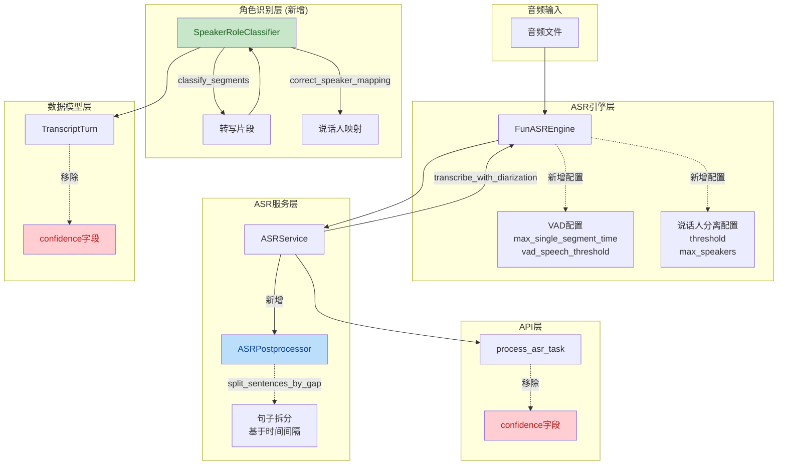

## 1. 高层摘要 (TL;DR)

*   **影响范围**: 🟡 **中等** - 重构ASR服务架构，新增说话人角色识别模块，移除confidence字段
*   **核心变更**:
    *   ✨ 新增 `SpeakerRoleClassifier` 模块，基于语义分析识别医生/患者角色
    *   🔄 重构 `ASRService`，移除硬编码的角色映射逻辑，职责更清晰
    *   📝 移除 `confidence` 字段，简化数据模型和API响应
    *   ⚙️ 增强 `FunASREngine` 配置能力，支持VAD和说话人分离参数调优
    *   🔧 新增 `ASRPostprocessor` 句子拆分功能，基于时间间隔智能分割

---

## 2. 可视化架构图



---

## 3. 详细变更分析

### 3.1 🆕 新增说话人角色识别模块

**组件**: `SpeakerRoleClassifier` (新增文件: `backend/services/speaker_role_classifier.py`)

**变更说明**:
新增了完整的说话人角色识别模块，通过语义分析自动识别医生和患者的对话。该模块使用正则表达式匹配、关键词分析、上下文推断等多种策略。

**核心功能**:

| 方法 | 功能描述 |
|------|---------|
| `classify_segments()` | 对转写片段进行角色分类 |
| `correct_speaker_mapping()` | 修正说话人ID到角色的映射 |
| `_calculate_doctor_score()` | 计算医生角色得分 |
| `_calculate_patient_score()` | 计算患者角色得分 |
| `_analyze_context()` | 基于上下文推断角色 |

**识别策略**:
- **医生模式**: "请问"、"哪里不舒服"、"持续多长时间"、"我给你(量/开/检查)" 等
- **患者模式**: "我这几天"、"我(一直/经常/有时候)"、"谢谢医生"、"我需要...吗" 等
- **问句分析**: 区分医生的问诊问题和患者的询问
- **混合片段检测**: 处理包含医生和患者特征的混合文本
- **上下文推断**: 根据前后对话推断当前说话人角色

---

### 3.2 🔄 ASR服务重构

**组件**: `ASRService` (源文件: `backend/services/asr_service.py`)

**变更说明**:
重构了 `transcribe_with_diarization()` 方法，移除了硬编码的角色映射逻辑，将职责分离。

**主要变更**:

| 变更类型 | 旧逻辑 | 新逻辑 |
|---------|--------|--------|
| **角色映射** | `_map_speaker()` 和 `_map_speaker_id()` 方法硬编码 | 移除，由 `SpeakerRoleClassifier` 处理 |
| **confidence字段** | 返回 `confidence: segment.get("confidence", 0.0)` | 移除，不再返回置信度 |
| **后处理** | 无 | 集成 `ASRPostprocessor` 进行句子拆分 |
| **时间戳单位** | 毫秒 (`int(segment.get("start", 0) * 1000)`) | 保持原始单位 (`segment.get("start", 0)`) |

**新增配置**:
```python
self.enable_sentence_split = config.get("enable_sentence_split", True)
self.split_gap_threshold_ms = config.get("split_gap_threshold_ms", 800)
```

**方法签名变化**:
```python
# 旧方法（已删除）
def _map_speaker(self, index: int) -> str
def _map_speaker_id(self, speaker_id: str, index: int) -> str

# 新增属性
self.postprocessor: Optional[ASRPostprocessor] = None
```

---

### 3.3 🔧 后处理器增强

**组件**: `ASRPostprocessor` (源文件: `backend/services/postprocessor.py`)

**变更说明**:
新增基于时间间隔的句子拆分功能，提升转写结果的粒度和可读性。

**新增方法**:

| 方法 | 功能 | 关键参数 |
|------|------|---------|
| `split_sentences_by_gap()` | 根据时间间隔拆分句子 | `split_gap_threshold_ms` (默认800ms) |
| `_find_gaps()` | 检测时间戳中的间隔位置 | - |
| `_split_by_gaps()` | 根据间隔位置拆分文本 | `min_segment_duration_ms` (默认200ms) |
| `_estimate_text_by_timestamp_ratio()` | 按时间戳比例估算文本片段 | - |
| `_add_punctuation()` | 为拆分后的文本添加标点 | - |
| `process_asr_result()` | 统一处理ASR结果 | `enable_sentence_split` |

**拆分逻辑**:
1. 检测时间戳之间的间隔（≥800ms）
2. 根据时间戳比例估算文本分割位置
3. 为拆分后的文本添加适当的标点符号
4. 过滤过短片段（<200ms）

---

### 3.4 ⚙️ FunASR引擎配置增强

**组件**: `FunASREngine` (源文件: `src/asr/funasr_engine.py`)

**变更说明**:
增强了 `create_medical_version()` 工厂方法，支持更细粒度的VAD和说话人分离配置。

**新增配置参数**:

| 参数 | 类型 | 默认值 | 说明 |
|------|------|--------|------|
| `speaker_threshold` | float | 0.7 | 说话人聚类阈值，越高越严格 |
| `max_speakers` | int | 2 | 最大说话人数量（医生+患者） |
| `max_single_segment_time` | int | 3000ms | VAD最大单段语音时长 |
| `vad_speech_threshold` | float | 0.5 | VAD语音检测阈值 |

**配置示例**:
```python
speaker_config = {
    "threshold": 0.7,
    "max_speakers": 2,
}

vad_config = {
    "max_single_segment_time": 3000,
    "vad_speech_threshold": 0.5,
}
```

---

### 3.5 🗑️ 移除confidence字段

**影响范围**: 数据模型、API、前端

**变更详情**:

| 文件 | 变更内容 |
|------|---------|
| `backend/models/transcript.py` | 移除 `TranscriptTurn.confidence` 列 |
| `backend/models/transcript.py` | 移除 `ASRCorrection.confidence` 列 |
| `backend/api/asr.py` | 移除 `process_asr_task()` 中的confidence赋值 |
| `backend/api/asr.py` | 移除 `get_transcript()` 中的confidence返回 |
| `backend/services/asr_service.py` | 移除turns中的confidence字段 |
| `backend/services/normalizer.py` | 移除normalized_turns中的confidence字段 |
| `frontend/js/result.js` | 移除置信度显示UI |

**数据库影响**:
⚠️ **注意**: 这是一个破坏性变更，需要数据库迁移来删除 `confidence` 列。

---

### 3.6 📦 模块导出更新

**组件**: `backend/services/__init__.py`

**新增导出**:
```python
from .speaker_role_classifier import SpeakerRoleClassifier, SpeakerRole, SpeakerSegment

__all__ = [
    "ASRService",
    "ASRPostprocessor",
    "TranscriptNormalizer",
    "SpeakerRoleClassifier",  # 新增
    "SpeakerRole",            # 新增
    "SpeakerSegment",         # 新增
]
```

---

## 4. 影响与风险评估

### 4.1 ⚠️ 破坏性变更

| 变更类型 | 影响范围 | 严重程度 |
|---------|---------|---------|
| **数据库Schema变更** | `TranscriptTurn` 和 `ASRCorrection` 表移除 `confidence` 列 | 🔴 高 |
| **API响应格式变更** | `/transcript` 端点不再返回 `confidence` 字段 | 🟡 中 |
| **前端UI变更** | 移除置信度显示组件 | 🟢 低 |

### 4.2 🧪 测试建议

**功能测试**:
- [ ] 验证说话人角色识别准确性（测试包含医生/患者对话的音频）
- [ ] 验证句子拆分功能是否正确处理停顿
- [ ] 验证VAD参数调整对转写结果的影响
- [ ] 验证数据库迁移脚本正确删除 `confidence` 列

**边缘情况**:
- [ ] 测试无说话人分离的音频文件
- [ ] 测试包含3个以上说话人的音频
- [ ] 测试短音频片段（<200ms）
- [ ] 测试混合说话人的片段

**回归测试**:
- [ ] 验证现有API端点正常工作
- [ ] 验证前端页面正常显示（无confidence字段）
- [ ] 验证转写结果保存到数据库正常

### 4.3 📊 性能影响

| 组件 | 变更 | 预期影响 |
|------|------|---------|
| `ASRService` | 新增后处理器 | 轻微增加处理时间 |
| `SpeakerRoleClassifier` | 新增语义分析 | 中等增加处理时间 |
| 数据库查询 | 移除confidence字段 | 轻微减少数据传输量 |

---

## 5. 总结

本次重构显著提升了ASR系统的架构清晰度和可维护性：

✅ **优点**:
- 职责分离清晰：ASR服务、后处理、角色识别各司其职
- 配置灵活：支持VAD和说话人分离参数调优
- 语义智能：新增角色识别模块，提升转写结果的语义理解

⚠️ **注意事项**:
- 需要执行数据库迁移
- 前端需要适配API响应格式变更
- 角色识别模块需要充分测试以确保准确性